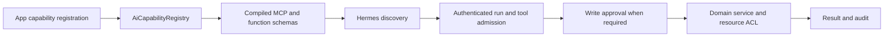

# App tools and MCP

This is the implementation guide for explicitly exposing app operations to an
agent. [ADR 0002](../../../adr/0002-mcp-capability-platform.md) owns the accepted
architecture; [App Platform](../app-platform/README.md) owns app admission.

## Common boundary

The existing registry is the common abstraction. Do not add another registry,
an app-specific MCP server, or a second tool dispatcher for an internal app.
`AiMcpClient` uses the common filtered surface and `InProcTransport` calls the
common tool service. The Hermes HTTP bridge adds trusted profile/run identity
and native approval integration. Internal tools use the same service operations
as the app, without calling its REST routers or accessing its database directly.

This direction is **agent → app tool**. **App → generative model** uses registered
LLM workloads and the [AI Gateway](gateway.md); a tool registration does not
authorize a new model/provider call.

## Explicit opt-in for a new app

Expose tools only when the feature request explicitly includes agent tool use.
Creating an app, REST endpoint, database model, or LLM workload does not itself
authorize exposing its operations as tools.

1. Add the app's capability module to its existing `app_registration(...,
ai_capability_modules=(...))`. An empty module list exposes no app tools.
   A module may register workloads without registering any tools.
2. Export `register_ai_capabilities(registry)` from that module. Register each
   allowed operation with `registry.register_tool(...)`; do not scan routers or
   infer tools from public Python methods. Unknown and duplicate registrations
   fail closed.
3. Define a dedicated Pydantic AI input model. Bound lengths/counts, reject extra
   fields, and describe identifiers and null/clear semantics. User, company,
   execution and approval identity come from the server context, never tool args.
4. Supply the owning app, description, handler and input model. The registry
   resolves the app discoverability predicate; additional feature/role policies
   must be registered explicitly. Resource authorization belongs in the service
   on every call, including direct calls and approved resumes.
5. For writes, follow [AI Write Policy](write-policy.md): flag-gated registration,
   `mode="write"`, approval, preview and audit. Register lookup/options tools when
   the model needs valid resource IDs, statuses, labels or assignees.
6. Compile and test the descriptor through the common MCP surface. Then use the
   actual chatbot to verify lookup, approval denial, approval acceptance and
   visible resource state. A handler unit test alone cannot establish delivery.

PMS provides the reference implementation:

- `apps/api/src/open_work_hub_api/domains/pms/app_catalog.py`: module opt-in.
- `apps/api/src/open_work_hub_api/domains/pms/tools.py`: AI inputs, options lookup,
  read operations and explicitly gated writes.
- `apps/api/src/open_work_hub_api/domains/pms/approval_preview.py`: write previews.

## Scope and lifecycle

| Run `allowed_app_ids` | Meaning                                                     |
| --------------------- | ----------------------------------------------------------- |
| Omitted or `null`     | No extra app filter; current server admission still applies |
| `[]`                  | Disable all app tools for this run                          |
| Explicit app IDs      | Intersect those IDs with current server admission           |

The ordinary chatbot has no app-scope picker and leaves this filter unset.
Conversation resource binding and tool app scope are separate contracts. A
hidden UI control must not turn into an empty tool scope. Existing runs retain
their recorded scope; retry in a new run after a client fix.

Registration is process-cached. Installing code is distinct from enabling write
tools and refreshing runtime catalogs. Follow [Hermes app tool setup](hermes.md#app-tool-enablement-and-verification).
Do not treat a native search result or MCP annotation as execution permission.

## Architecture review and next extensions

| Approach                                                      | Tradeoff                                                                                      | Recommendation                         |
| ------------------------------------------------------------- | --------------------------------------------------------------------------------------------- | -------------------------------------- |
| Extend the existing descriptor/registry and shared MCP bridge | One admission, approval, schema and audit path; app owners provide only adapters              | Use for internal apps                  |
| Separate MCP server for each app                              | Independent deployment, but repeats identity, operations and lifecycle management             | Reserve for genuinely separate systems |
| Automatically export REST/OpenAPI operations                  | Quick inventory, but human DTOs and bulk/destructive endpoints become model-facing implicitly | Do not use for opt-in app tools        |

The following are proposals, not implemented guarantees:

- Add an optional typed output model to the existing descriptor and compile its
  MCP `outputSchema`. Validate the structured result at the common dispatcher.
  The current `output_projection` controls returned content; it is not a typed
  output schema. Add a contract revision when input/output compatibility breaks.
- Give administrators a view of the existing registry, owning app, gate state,
  approval mode and last execution result. Keep the registry authoritative;
  policy data may disable registered tools but must not manufacture handlers.
- Include browser → native run → MCP → service evidence in app-tool acceptance,
  covering `null`/empty/explicit scope, disabled app, viewer/editor, approval
  accept/reject, argument changes/replay, failure outcome and catalog refresh.

## Official references

- [MCP tools](https://modelcontextprotocol.io/specification/2025-11-25/server/tools):
  discovery, JSON Schema inputs/outputs, structured results and error semantics.
- [MCP security practices](https://modelcontextprotocol.io/docs/2025-11-25/tutorials/security/security_best_practices):
  credential audience and delegation boundaries; no token passthrough.
- [Hermes MCP](https://hermes-agent.nousresearch.com/docs/user-guide/features/mcp):
  configured servers, tool filters and catalog refresh.
- [Hermes Tool Search](https://hermes-agent.nousresearch.com/docs/user-guide/features/tool-search)
  and [middleware](https://hermes-agent.nousresearch.com/docs/developer-guide/middleware):
  official discovery and execution extension points. Verify behavior against the
  pinned image before adopting current upstream documentation.
