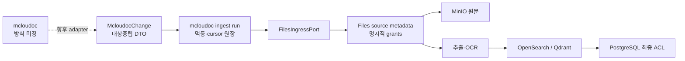

# mcloudoc 연계 경계

이 문서는 문서중앙화 시스템 mcloudoc를 AI-DO Files 검색·RAG 파이프라인에
연결하기 위한 현재 구현 경계와 활성화 조건의 정본이다. 대상 시스템의 전송 방식,
인증, 변경 식별 규칙, 메타데이터·권한 사전이 확정되지 않았으므로 외부 adapter는
아직 구현하지 않는다.

## 현재 판정

| 구분                                           | 상태                                                  |
| ---------------------------------------------- | ----------------------------------------------------- |
| 대상중립 change/run 계약                       | 구현                                                  |
| source·document·ingest run 영속 원장           | 구현                                                  |
| Files 수용 port와 실제 Files lifecycle binding | 구현·focused 계약 시험                                |
| 원문 저장·추출·OCR·BM25·vector·hybrid·rerank   | 기존 Files 경로 재사용, 실제 mcloudoc/backend E2E N/T |
| typed 메타데이터·명시적 ACL projection         | 구현                                                  |
| mcloudoc REST/webhook/polling adapter          | 미구현 — 대상 방식 미정                               |
| mcloudoc 인증·필드·identity/ACL 매핑           | 미구현 — 대상 계약 미제공                             |
| 실제 표본 공동 E2E/UAT                         | N/T — 외부 선행조건 미충족                            |

이 기반은 범용 `Knowledge` 모델의 재도입이 아니다. 원문과 검색 identity의 정본은
계속 `file_manager_files`이며 resource type은 `file_manager_file`, RAG source kind는
`files`를 사용한다.

## 경계와 처리 흐름

외부 adapter가 맡을 일은 인증, 호출·수신, 대상 payload 해석, 원문 byte 확보,
외부 principal을 AI-DO principal로 해석하는 일이다. Core는 전달받은 결과의 크기와
형태, idempotency, lifecycle, 최종 ACL을 책임진다. Core가 임의로 revision의 대소를
비교하거나 대상 필드 의미를 추측하지 않는다.

## 영속 모델

- `mcloudoc_sources`: scope, Files corpus, ingest owner와 활성 상태를 보관한다. 생성
  시 기본 비활성이며 실제 전송 계약과 scope 결정 전에는 운영 source를 만들거나
  활성화하지 않는다.
- `mcloudoc_documents`: `(source, external identity)`의 안정적인 문서 identity와
  Files file ID, opaque revision/checksum, typed metadata, 제한된 raw payload, quarantine
  상태를 보관한다.
- `mcloudoc_ingest_runs`: incremental/snapshot 실행, delivery idempotency, opaque
  continuation, 처리 건수와 제한된 오류를 보관한다. 한 source에는 한 run만 실행된다.
- `file_manager_file_source_metadata`: Files resource의 source identity와 검색 가능한
  typed metadata를 보관한다. raw payload와 source URI는 검색 결과나 사용자 응답에
  포함하지 않는다.
- `file_manager_file_access_grants`: `company`, `workspace`, `user`, `org_unit`, `team`
  read grant를 보관한다.

## lifecycle과 멱등성

- 같은 delivery와 같은 payload의 재전달은 no-op이다. 같은 delivery identity에 다른
  payload가 오면 충돌로 중단한다.
- 외부 revision은 opaque 문자열로 보관하며 순서를 추론하지 않는다. source run을
  직렬화하고 delivery idempotency로 중복을 막는다.
- 본문이 바뀌면 versioned object를 저장하고 기존 추출물을 무효화한 뒤 CONTENT
  projection event를 발행한다.
- typed metadata만 바뀌면 기존 추출물을 재사용하면서 검색·RAG projection을 갱신한다.
- ACL만 바뀌면 VISIBILITY event를 발행한다.
- delete는 Files tombstone과 DELETE event로 전파한다.
- snapshot의 누락 문서는 adapter가 완료를 선언한 complete snapshot에서만
  tombstone 처리한다. partial snapshot은 삭제 근거가 아니다.
- 기반 migration의 downgrade는 explicit-grant corpus, source metadata·grant 또는
  mcloudoc 원장 데이터가 한 건이라도 있으면 첫 DDL 전에 중단한다. 연계 데이터가 생긴 뒤의
  rollback은 downgrade로 권한 모델을 축소하지 않고 배포 전 DB backup과 이전 binary를 함께
  복원해야 한다.

## 권한과 격리

- mcloudoc corpus는 `source_managed=true`, `authorization_mode=explicit_grants`를
  사용한다. 기존 Files corpus는 `cohort` 기본값을 유지한다.
- ACL이 없거나 하나라도 해석되지 않으면 문서를 quarantine하고 일반 사용자에게
  어떤 grant도 부여하지 않는다.
- Workspace admin은 명시적 문서 grant를 우회하지 않는다. 현재 활성
  `platform_admin`만 운영 복구를 위한 bypass를 가진다.
- 후보 검색 결과, 다운로드, 미리보기, 대화·citation은 모두 PostgreSQL source ACL을
  최종 판정으로 사용한다. OpenSearch/Qdrant payload는 권한의 정본이 아니다.
- raw metadata, raw ACL과 미검증 source URI는 색인·검색 응답·citation 링크에
  포함하지 않는다.

## 입력 제한

| 항목               |              제한 |
| ------------------ | ----------------: |
| raw metadata       | UTF-8 JSON 64 KiB |
| raw ACL            | UTF-8 JSON 64 KiB |
| resolved grants    |      문서당 500개 |
| searchable content |    문서당 120 MiB |
| 기록하는 run 오류  |       run당 100개 |

## 외부 계약 확정 후 할 일

1. transport 방식과 인증/TLS/호출 방향을 확정한다.
2. 목록·원문·변경·삭제·pagination/cursor·rate limit 계약을 고정한다.
3. 제목, 작성자, 작성일, 부서, 문서 종류와 실제 원천 필드를 매핑한다.
4. mcloudoc principal을 AI-DO 사용자·조직·팀으로 해석하는 기준과 미해결 정책을
   공동 승인한다.
5. 표본으로 최초 수집, 신규·변경·삭제, ACL revoke, 재시도, partial/complete
   snapshot과 검색·답변·다운로드 E2E를 수행한다.
6. 위 시험을 통과한 별도 활성화 변경에서 source를 생성하고 worker/schedule을
   명시적으로 켠다.

## 검증 경로

- 계약 제한: `apps/api/tests/test_mcloudoc_contracts.py`
- run·증분·snapshot·quarantine: `apps/api/tests/test_mcloudoc_service.py`
- source binding·Files lifecycle 접합: `apps/api/tests/test_mcloudoc_files_adapter.py`
- Files 외부 lifecycle·ACL: 해당 Files focused tests
- 검색 projection·최종 ACL: `apps/api/tests/test_files_search.py`와 Files source-access
  focused tests

관련 플랫폼 계약은 [Retrieval](../retrieval/README.md),
[RAG source matrix](../rag/source-matrix.md),
[외부 REST 연계 계약](../api-integrations/README.md)을 따른다. 현재 mcloudoc에는 외부
REST endpoint나 API key scope를 열지 않는다.
