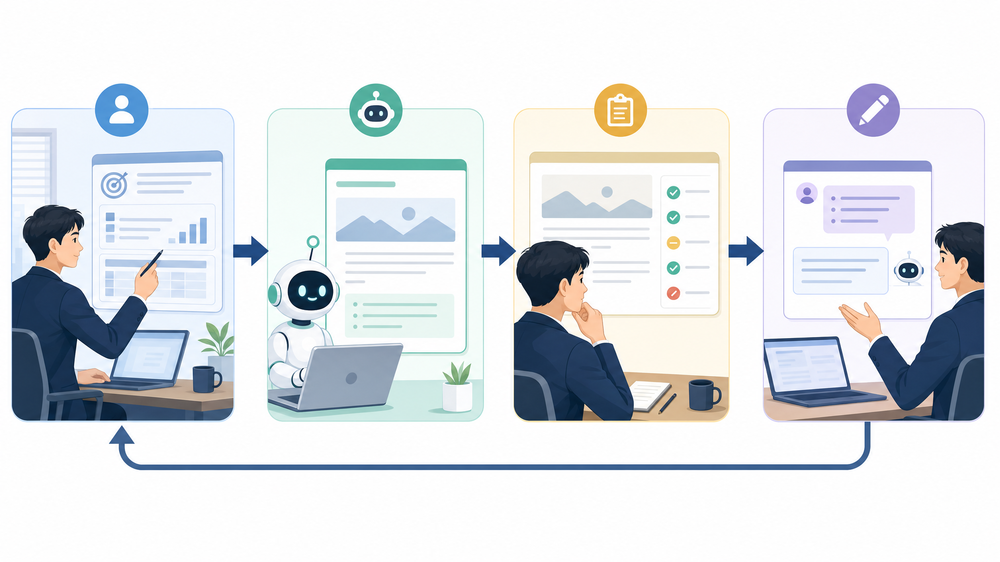

# 현업을 위한 AI-Doo 12주 교육

> **한 줄 요약.** 이 과정은 현업 담당자가 AI-Doo를 단순히 “써 보는” 수준을 넘어, 좋은 질문을 만들고, 결과를 검수하고, 운영 품질을 함께 관리할 수 있게 만드는 12주 실무 교육이다.

이 그림은 12주 교육의 기본 방향을 보여 줍니다. 처음 3주는 AI와 일하는 기본 루프를 만들고, 4~9주는 LLM/RAG/승인/운영 품질을 익히며, 마지막 3주는 저장소 선택·서비스 여정·운영 인계로 마무리합니다.

## 이 과정을 듣는 사람

- AI-Doo 포털을 실제 업무에 도입할 현업 담당자.
- 문서 검색, PLM 연동, 회의록, 메일 초안, 보고서 작성 같은 업무를 AI와 연결해야 하는 사람.
- 개발자는 아니지만 “AI 답변을 믿어도 되는지”, “어떤 자료를 넣어야 하는지”, “운영할 때 무엇을 봐야 하는지” 판단해야 하는 사람.

## 매주 반복하는 수업 구조

| 순서 | 활동 | 목적 |
| --- | --- | --- |
| 1 | 오늘의 그림 | 기술 흐름을 먼저 눈으로 잡는다 |
| 2 | 업무 상황 | 두원 현업 사례로 왜 필요한지 확인한다 |
| 3 | 핵심 개념 3개 | 한 번에 너무 많이 배우지 않는다 |
| 4 | 작동 흐름 | 입력, 처리, 결과, 검수 기준을 연결한다 |
| 5 | 실습 | 현업 산출물을 직접 만든다 |
| 6 | 회상 질문 | 다음 주 시작 5분 복습에 쓴다 |
| 7 | 기존 자료 연결 | 더 깊게 볼 기존 Learning 레슨을 안내한다 |

## 12주 커리큘럼

| 주차 | 주제 | 실습 산출물 |
| --- | --- | --- |
| W1 | AI 시대 협업과 좋은 요청 | 좋은 요청 템플릿 |
| W2 | 작업 분해와 프롬프트 설계 | 기능 요청 분해표 |
| W3 | AI 결과 검수와 변경 관리 | AI 결과 검수 체크리스트 |
| W4 | LLM 기초와 모델 라우팅 | 내부/외부 LLM 판단표 |
| W5 | RAG와 근거 기반 답변 | 사내 문서 질문 10개 |
| W6 | 문서 인덱싱 파이프라인 | chunk/metadata/권한 설계 |
| W7 | 검색 품질: 키워드·벡터·재정렬 | 검색 방식 비교표 |
| W8 | AI 도구 호출과 승인 게이트 | read/write 승인 흐름도 |
| W9 | 평가·관측·운영 품질 | 평가셋 50문항 초안 |
| W10 | 데이터베이스와 저장소 선택 | 저장소 선택 체크리스트 |
| W11 | 아이디어에서 출시까지 | 작은 서비스 개발 여정 1장 |
| W12 | 회고와 운영 인계 | PoC 인계 노트 |

## 기존 교육자료 활용 원칙

이 과정은 기존 자료를 대체하지 않습니다. 기존 코스는 상세 참고 자료이고, 이 코스는 12주 운영 수업용 압축본입니다.

| 활용 구간 | 기존 자료 |
| --- | --- |
| W1~W3 | `vibe-coding-foundations` |
| W4~W9 | `vibe-coding-foundations/32-AI레이어-OpenAI-SSE-MCP.md`, ADR 0002 |
| W10 | `database-storage-basics`, 특히 08~09 |
| W11~W12 | `service-launch-journey`, 특히 02, 05, 10, 11, 26, 27 |

## 이 과정을 마친 뒤 할 수 있어야 하는 말

“AI-Doo에 좋은 질문을 넣는 것만으로는 부족하다. 어떤 데이터를 근거로 삼는지, 권한이 맞는지, 답변을 어떻게 검수하는지, 운영 중 품질을 어떻게 재는지까지 같이 관리해야 한다.”
