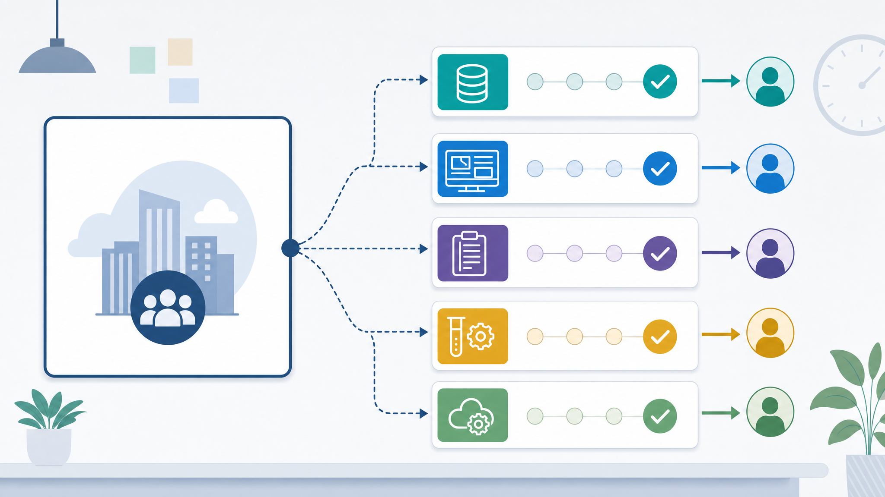

# 02. 작업 분해와 프롬프트 설계

> **한 줄 요약.** AI에게 큰 일을 한 번에 맡기지 말고, 확인 가능한 작은 작업으로 쪼개야 품질과 일정이 모두 관리된다.



그림은 큰 업무 요청을 작은 단위로 나누는 흐름입니다. 요구사항, 데이터, 화면, 검수, 운영 조건을 분리하면 각 단계의 책임과 확인 지점이 선명해집니다.

## 업무 상황

“회의록 자동 생성”은 하나의 기능처럼 보이지만 실제로는 여러 작업입니다. 녹음 파일 업로드, 음성 인식, 발화자 구분, 요약, 액션아이템 추출, 사람이 수정하는 화면, 최종 문서 저장까지 이어집니다. 이걸 한 번에 요청하면 결과가 어디서 틀렸는지 알기 어렵습니다.

## 핵심 개념 3개

| 개념 | 설명 |
| --- | --- |
| 분해 | 큰 요청을 확인 가능한 작은 요청으로 나누는 일 |
| 순서 | 먼저 결정해야 다음 작업이 가능한 것을 앞에 둔다 |
| 중간 확인 | 한 번에 끝내지 않고 결과를 보며 방향을 조정한다 |

## 작동 흐름

| 큰 요청 | 작은 작업 |
| --- | --- |
| 회의록 자동 생성 | 녹음 업로드 방식 정하기 |
|  | 음성 인식 결과 품질 기준 정하기 |
|  | 회의록 초안 형식 정하기 |
|  | 사람이 수정하고 승인하는 흐름 정하기 |
|  | 저장 위치와 권한 정하기 |

## 실습

아래 기능 요청 1개를 5~7개의 작은 작업으로 나눕니다.

```text
PLM과 문서 검색을 합쳐서 통합 검색을 만들고 싶다.
```

| 순서 | 작은 작업 | 확인 방법 |
| --- | --- | --- |
| 1 |  |  |
| 2 |  |  |
| 3 |  |  |
| 4 |  |  |
| 5 |  |  |

## 회상 질문

1. 큰 요청을 그대로 AI에게 맡기면 왜 검수가 어려운가?
2. 작업을 쪼갤 때 “데이터 확인”이 앞에 와야 하는 이유는 무엇인가?
3. 중간 확인이 없으면 일정 관리에서 어떤 문제가 생기는가?

## 기존 자료 연결

- `vibe-coding-foundations/14-프롬프트-워크북.md`
- `vibe-coding-foundations/17-기획과-요구사항-정의.md`
