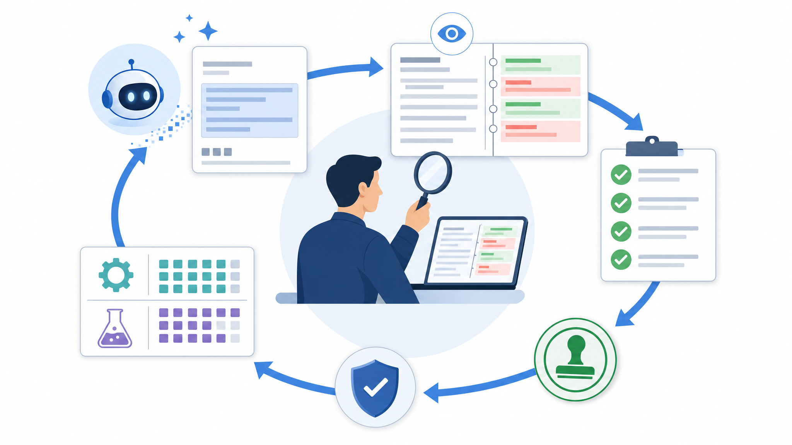

# 03. AI 결과 검수와 변경 관리

> **한 줄 요약.** AI 결과는 완성품이 아니라 검수 대상이다. 변경 전후 차이, 테스트 결과, 업무 기준 충족 여부를 확인해야 한다.

그림은 AI 산출물이 바로 배포되지 않고 검수 루프를 통과해야 함을 보여 줍니다. 요청, 결과, 차이, 테스트, 승인 기록이 남아야 다음 사람이 이어받을 수 있습니다.

## 업무 상황

AI가 “검색 결과 카드 UI를 고쳤다”고 말해도, 현업은 무엇이 달라졌는지 확인해야 합니다. 출처 링크가 여전히 보이는지, 권한 없는 문서가 노출되지 않는지, 모바일 화면이 깨지지 않는지 확인해야 합니다.

## 핵심 개념 3개

| 개념 | 설명 |
| --- | --- |
| diff | 변경 전후 차이를 보는 기록 |
| 테스트 | 의도한 기능이 계속 맞는지 확인하는 절차 |
| 승인 | 사람이 책임지고 다음 단계로 넘기는 결정 |

## 작동 흐름

| 단계 | 확인 질문 |
| --- | --- |
| 변경 내용 확인 | 무엇이 바뀌었는가 |
| 영향 범위 확인 | 어떤 화면, API, 데이터가 영향받는가 |
| 테스트 확인 | 자동/수동 검증이 무엇을 통과했는가 |
| 업무 기준 확인 | 현업 사용 시나리오가 만족되는가 |
| 승인 기록 | 누가 어떤 근거로 승인했는가 |

## 실습

AI가 만든 결과를 검수하기 위한 체크리스트를 작성합니다.

| 항목 | 질문 | 확인 결과 |
| --- | --- | --- |
| 목적 | 원래 요청을 해결했는가 |  |
| 데이터 | 잘못된 데이터가 섞이지 않았는가 |  |
| 권한 | 볼 수 없는 정보가 보이지 않는가 |  |
| 사용성 | 현업 사용자가 이해할 수 있는가 |  |
| 운영 | 문제가 생기면 되돌릴 수 있는가 |  |

## 회상 질문

1. AI가 “완료했다”고 말해도 사람이 확인해야 하는 이유는 무엇인가?
2. 테스트 결과와 업무 검수는 어떻게 다른가?
3. 변경 기록이 없으면 다음 담당자에게 어떤 문제가 생기는가?

## 기존 자료 연결

- `vibe-coding-foundations/04-버전관리-Git.md`
- `vibe-coding-foundations/13-검증과-테스트.md`
- `vibe-coding-foundations/35-바이브코딩-실전워크플로.md`
