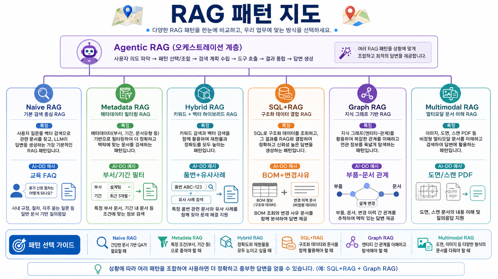
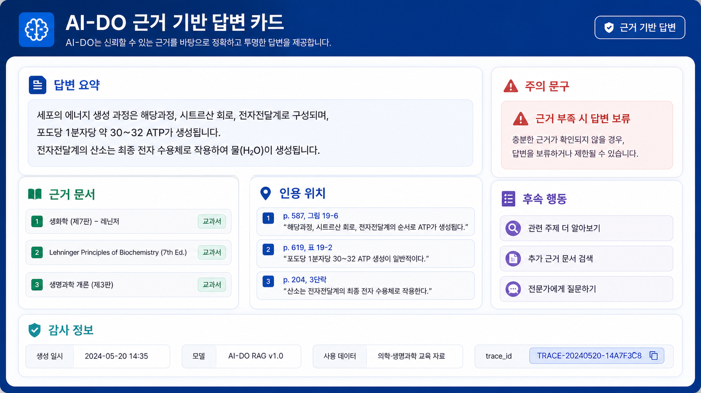
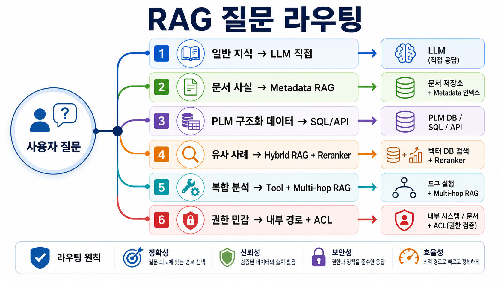
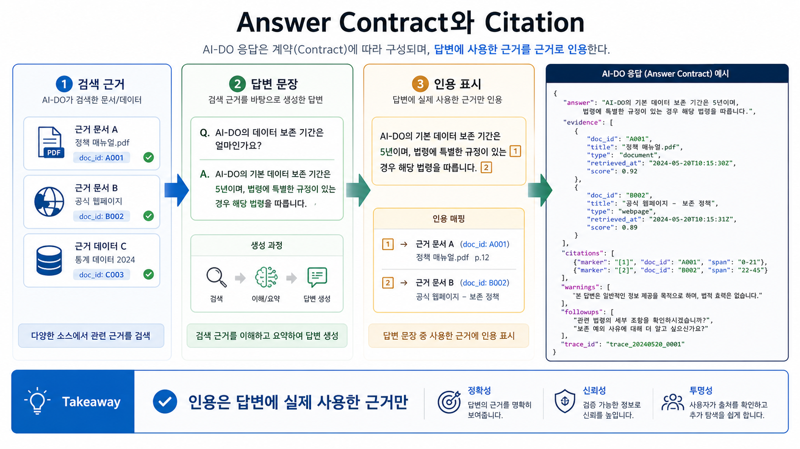

# 05. RAG 패턴과 근거 기반 답변 설계

> **한 줄 요약.** RAG는 “문서를 벡터DB에 넣고 질문한다”가 아니라, 회사의 최신 지식과 권한을 답변 생성 과정에 안전하게 연결하는 운영 아키텍처다.

## 오늘의 목표

AI-DO의 RAG는 문서중앙화, PLM, 회의록, 메일 초안, 보고서 작성과 연결된다. 이번 회차는 RAG의 기본 구조뿐 아니라 실제 운영에서 필요한 패턴과 실패 지점을 이해하는 데 초점을 둔다.

| 배울 것 | AI-DO 연결 |
| --- | --- |
| Parametric memory와 non-parametric memory | 모델 지식과 사내 문서 지식을 구분 |
| RAG 기본 흐름 | 질문 → 검색 → 근거 선별 → 답변 → 출처 |
| RAG 패턴 | query rewriting, hybrid search, reranking, multi-hop, table/graph/multimodal RAG |
| 근거 기반 답변 UI | 답변, 인용, 원문 링크, 경고, confidence |
| 실패 원인 | 검색 실패, 권한 누락, 문서 품질, hallucination, 오래된 자료 |

## RAG의 핵심 아이디어

모델은 학습 시점의 일반 지식을 파라미터 안에 저장한다. 하지만 사내 문서, PLM 변경 이력, 최신 회의록, 부서별 업무 기준은 모델 안에 없다. RAG는 모델이 답변하기 전에 외부 지식 저장소를 검색하게 만들어 최신성과 근거성을 보완한다.

| 구분 | 의미 | AI-DO 예시 |
| --- | --- | --- |
| Parametric memory | 모델이 학습 과정에서 내부에 갖게 된 일반 지식 | “RAG가 무엇인가?” |
| Non-parametric memory | 검색으로 가져오는 외부 지식 | 사내 규정, PLM 변경 사유, 프로젝트 회의록 |
| Grounding | 답변을 검색 근거에 묶는 일 | “이 답변은 문서 A, B의 3개 문단에 기반함” |
| Provenance | 근거의 출처와 추적성 | 문서 ID, 버전, 작성일, 권한, 링크 |

## AI-DO RAG 기본 흐름

| 단계 | 처리 | 품질 기준 |
| --- | --- | --- |
| 질문 해석 | 사용자가 찾는 대상, 기간, 부서, 품번, 문서 종류를 파악 | 검색 조건이 빠지지 않았는가 |
| 질의 변환 | 동의어, 품번 표기, 부서명, 약어를 보강 | 현업 표현을 시스템 표현으로 바꿨는가 |
| 검색 | 키워드, 벡터, metadata filter를 조합 | 후보 문서가 충분히 recall 되는가 |
| 재정렬 | 질문과 후보 근거의 실제 관련성을 다시 평가 | top-k가 답변에 쓸 만큼 정확한가 |
| 근거 압축 | 긴 문서에서 필요한 문단/표/항목만 구성 | 컨텍스트 예산을 낭비하지 않는가 |
| 답변 생성 | 근거 범위 안에서만 답변 | 근거 없는 추론을 구분하는가 |
| 출처 표시 | 문서명, 작성일, 링크, 문단 위치 표시 | 사용자가 원문을 검증할 수 있는가 |

## RAG 패턴 지도

_RAG는 단일 패턴이 아니라 질문, 데이터 구조, 권한, 멀티모달 여부에 따라 여러 패턴을 조합한다._

| 패턴 | 언제 쓰나 | AI-DO 예시 |
| --- | --- | --- |
| Naive RAG | 작은 문서셋, 단순 질의 | 교육자료 FAQ |
| Metadata-filtered RAG | 부서, 문서등급, 날짜, 제품군이 중요 | 설계팀 문서 중 2025년 이후 변경 사례 |
| Query rewriting | 현업 표현과 문서 표현이 다름 | “물이 샌다” → “누수, 실링, 방수, leakage” |
| Hybrid RAG | 정확한 품번과 의미 검색이 함께 필요 | 품번 + 유사 불량 사례 검색 |
| Reranked RAG | 후보가 많고 top-k 품질이 중요 | 여러 부서 문서 중 실제 근거 선별 |
| Multi-hop RAG | 여러 문서를 연결해야 답이 나옴 | 변경 요청서 → 회의록 → 최종 승인 문서 |
| Table/SQL + RAG | 구조화 데이터와 비정형 설명이 섞임 | BOM은 SQL, 변경 사유는 RAG |
| Graph RAG | 사람/부품/문서/프로젝트 관계가 중요 | 특정 부품과 관련된 이슈·도면·회의록 연결 |
| Multimodal RAG | 이미지, 스캔 PDF, 표, 도면이 포함 | 도면 설명서, 검사표, 차트 이미지 |
| Self/agentic RAG | 검색 필요 여부와 검색 전략을 모델이 조정 | 복합 질문에서 검색 반복·반성·재질문 |

## 근거 기반 답변 카드

_업무 답변은 결론, 근거 문서, 인용 위치, 경고, 후속 행동, 감사 정보를 함께 제공해야 검증 가능하다._

AI-DO 답변은 “그럴듯한 문장”이 아니라 검증 가능한 업무 산출물이어야 한다.

| 영역 | 포함할 내용 |
| --- | --- |
| 답변 요약 | 사용자가 바로 읽을 수 있는 핵심 결론 |
| 근거 문서 | 문서명, 버전, 작성일, 작성 부서, 문서 등급 |
| 인용 위치 | 페이지, 문단, 표, PLM 항목 ID |
| 주의 문구 | “근거 부족”, “최신 문서 아님”, “권한 제한으로 일부 제외” |
| 후속 행동 | 원문 열기, 관련 문서 더 보기, 담당자 문의, 초안 생성 |
| 감사 정보 | 사용 모델, 검색 인덱스 버전, 실행 시각, 사용자 |

## PLM과 RAG를 섞을 때의 원칙

PLM은 모두 RAG로 넣는 것이 아니다. 데이터 성격에 따라 검색 방식을 나눈다.

| 데이터 | 우선 방식 | 이유 |
| --- | --- | --- |
| 품번, BOM, 도면번호 | PLM API 또는 SQL | 정확한 원천 데이터가 필요 |
| 변경 이력의 날짜/승인자 | PLM API 또는 SQL | 조건 검색과 정합성이 중요 |
| 변경 사유, 회의 메모, 이슈 설명 | RAG | 자연어 표현과 유사 사례 검색이 중요 |
| 도면 이미지와 스캔 문서 | OCR/vision + RAG | 시각 정보와 텍스트 추출이 함께 필요 |
| 종합 답변 | SQL/API 결과 + RAG 근거 + LLM 설명 | 구조화 데이터와 문서 근거를 합쳐야 함 |

## 대표 실패 모드

| 실패 | 증상 | 원인 | 대응 |
| --- | --- | --- | --- |
| 검색 누락 | 답변이 “자료 없음”으로 나옴 | query rewrite 부족, metadata 누락 | 동의어 사전, 필터 완화, 평가셋 보강 |
| 근거 오염 | 다른 부서/권한 문서가 섞임 | ACL 동기화 실패 | 권한 필터를 검색 전·후 모두 적용 |
| 오래된 답변 | 최신 기준이 반영 안 됨 | 인덱스 갱신 지연 | 문서 버전, 재색인 트리거, 최신성 ranking |
| 그럴듯한 오류 | 문장은 자연스러운데 틀림 | 모델이 근거 밖 추론 | “근거 없음” 응답 허용, 인용 강제, judge 평가 |
| 표/도면 오류 | 수치나 위치를 잘못 읽음 | OCR/vision 한계 | 원문 미리보기, 사람 검수, high-risk 표시 |

## RAG 설계는 질문 분류에서 시작한다

_질문을 일반 지식, 문서 사실, 구조화 데이터, 유사 사례, 복합 분석, 권한 민감 요청으로 먼저 나누면 검색 경로가 명확해진다._

좋은 RAG는 질문이 들어오자마자 “무엇을 검색해야 하는가”를 분류한다. 모든 질문을 같은 vector search로 보내면 품번, 날짜, 권한, 최신성 같은 운영 조건을 놓치기 쉽다.

| 질문 분류 | 판단 기준 | 우선 경로 |
| --- | --- | --- |
| 일반 지식 | 사내 문서가 없어도 답할 수 있음 | LLM 직접 답변 또는 교육자료 링크 |
| 문서 사실 확인 | 특정 기준서, 회의록, 절차서 근거 필요 | metadata-filtered RAG |
| 구조화 데이터 | 품번, BOM, 상태, 승인자, 날짜가 핵심 | PLM API/SQL 우선 |
| 유사 사례 | 표현이 다양하고 과거 사례를 찾아야 함 | hybrid RAG + reranker |
| 복합 분석 | 여러 문서와 PLM 데이터를 연결해야 함 | tool/API + multi-hop RAG |
| 권한 민감 | NDA, 고객사, 개인정보, 부서 제한 포함 | 내부 경로 + ACL filter + audit |
| 근거 부족 | 질문이 애매하거나 문서가 없음 | 재질문 또는 no-answer |

질문 분류 결과는 trace에 남겨야 한다. 나중에 “왜 이 질문이 외부 API로 갔는가”, “왜 PLM API가 아니라 RAG를 썼는가”를 설명할 수 있어야 하기 때문이다.

## Query rewriting과 context engineering

RAG 품질은 “무엇을 검색했는가”와 “무엇을 모델에 넣었는가”에서 결정된다.

| 단계 | 해야 할 일 | 예시 |
| --- | --- | --- |
| Query normalization | 오탈자, 약어, 품번 표기, 한/영 표현 정규화 | “P-1234”, “P1234”, “품번 1234” 통합 |
| Query expansion | 현업 표현과 문서 표현을 함께 검색 | “물이 샌다” + “누수/leakage/sealing” |
| Metadata binding | 기간, 부서, 제품군, 문서 유형을 필터로 분리 | “2025년 설계팀 기준서” |
| Decomposition | 복합 질문을 여러 검색으로 나눔 | 변경 사유 검색 + 승인 문서 검색 |
| Context packing | top-k chunk를 그대로 넣지 않고 답변에 필요한 근거만 구성 | 중복 chunk 제거, 최신 문서 우선 |
| Evidence compression | 긴 문단을 표·bullet·인용 단위로 압축 | 모델 입력 예산 절감 |

Context engineering은 prompt engineering과 다르다. prompt가 모델의 행동 규칙을 정한다면, context engineering은 모델이 볼 수 있는 근거의 범위와 순서를 정한다.

## Answer contract와 citation policy

_답변 계약은 자연어 문장과 evidence, citation, warning, follow-up, trace를 분리해 UI와 평가가 읽을 수 있게 만든다._

근거 기반 답변은 자연어 답변만 저장하면 운영하기 어렵다. AI-DO 답변은 UI와 평가가 읽을 수 있는 계약을 가져야 한다.

| 필드 | 의미 |
| --- | --- |
| `answer` | 사용자에게 보여 줄 결론 |
| `evidence[]` | 답변에 실제 사용한 문서/PLM 항목 목록 |
| `citations[]` | 문장 또는 bullet별 근거 위치 |
| `confidence` | 높음/중간/낮음 또는 정량 점수 |
| `warnings[]` | 근거 부족, 오래된 문서, 권한 제한, 수치 검수 필요 |
| `followups[]` | 원문 열기, 추가 검색, 담당자 문의, 초안 생성 |
| `trace_id` | 운영자가 재현할 수 있는 요청 ID |

인용 정책은 “검색된 문서를 모두 보여 주기”가 아니다. 답변 문장을 실제로 뒷받침한 근거만 인용해야 한다. 검색됐지만 답변에 쓰지 않은 문서는 “관련 문서”로 분리한다.

## RAG를 쓰지 말아야 하는 경우

RAG는 강력하지만 모든 문제의 답은 아니다.

| 상황 | 더 나은 방식 |
| --- | --- |
| 현재 재고, 승인 상태, BOM 최신값처럼 원천 DB가 정답인 경우 | SQL/API 직접 조회 |
| 문서가 없거나 품질이 매우 낮은 경우 | 문서 수집/정비 먼저 진행 |
| 법적 판단, 안전 관련 최종 결정 | 전문가 검토와 승인 워크플로 |
| 단순 분류나 라우팅처럼 근거 문서가 필요 없는 반복 작업 | small classifier, rule, fine-tuned 모델 |
| 권한이 복잡하고 ACL 동기화가 불가능한 데이터 | RAG 노출 전 권한 모델 재설계 |

RAG를 쓰지 않는 판단도 설계 역량이다. 특히 PLM의 정확한 상태값은 “문서에 써 있던 설명”보다 원천 시스템을 우선해야 한다.

## 실습: 사내 RAG 질문 설계

아래 유형을 포함해 20개 질문을 만든다. 질문마다 필요한 근거와 정답 확인 방법을 적는다.

| 유형 | 문항 수 | 질문 예시 | 필요한 근거 |
| --- | --- | --- | --- |
| 사실 확인 | 4 | 특정 품번의 최신 변경 승인일은? | PLM 항목, 승인 문서 |
| 절차 안내 | 4 | 설계 변경 요청 절차는 어떻게 되는가? | 업무 기준서 |
| 유사 사례 | 4 | 과거 유사 불량에서 원인이 무엇이었나? | 이슈 보고서, 회의록 |
| 비교/요약 | 4 | 두 부서의 처리 기준 차이는? | 문서 2개 이상 |
| 권한/보안 | 4 | 권한 없는 자료가 답변에 섞이지 않는가? | 차단 케이스 |

각 질문에는 다음 필드를 추가한다.

| 필드 | 작성 기준 |
| --- | --- |
| 질문 분류 | 일반 지식/문서 사실/구조화 데이터/유사 사례/복합 분석/권한 민감/no-answer |
| 검색 경로 | LLM 직접/SQL/API/keyword/vector/hybrid/multimodal |
| 필수 metadata | 부서, 기간, 제품군, 문서등급, 작성일 등 |
| 기대 answer contract | 답변, 인용, warning, follow-up |
| 실패 시 원인 후보 | 질문 해석, 검색, 권한, 문서 품질, 생성 중 어디인지 |

## 회상 질문

1. RAG와 단순 검색의 차이는 무엇인가?
2. PLM 구조화 데이터를 RAG로만 처리하면 어떤 문제가 생기는가?
3. 근거 기반 답변에서 “출처 링크”만으로 부족한 이유는 무엇인가?
4. Self-RAG나 agentic RAG가 필요한 질문은 어떤 유형인가?
5. RAG를 쓰지 않고 SQL/API나 rule로 처리해야 하는 질문은 무엇인가?

## 참고 원천

- Retrieval-Augmented Generation for Knowledge-Intensive NLP Tasks: https://papers.nips.cc/paper/2020/hash/6b493230205f780e1bc26945df7481e5-Abstract.html
- Self-RAG: https://huggingface.co/papers/2310.11511
- Evaluation of Retrieval-Augmented Generation: A Survey: https://arxiv.org/abs/2405.07437
