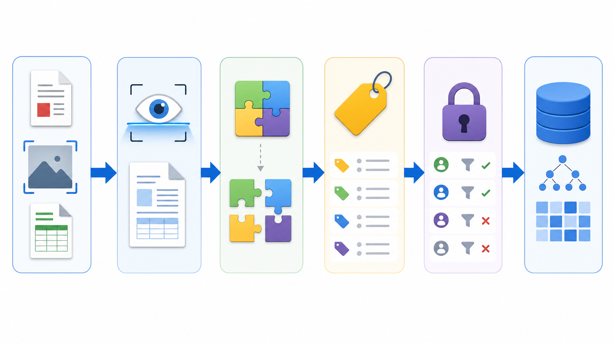

# 06. 문서 인덱싱 파이프라인

> **한 줄 요약.** AI 검색 품질은 모델보다 앞단의 문서 정리, OCR, 청킹, 메타데이터, 권한 동기화에서 크게 갈린다.

그림은 PDF, 이미지, 문서 파일이 검색 가능한 조각으로 바뀌는 과정을 보여 줍니다. 원본 파일, 텍스트 추출, chunk, metadata, permission, index가 서로 다른 역할을 가집니다.

## 업무 상황

스캔된 PDF 도면 설명서가 있다고 가정합니다. 파일은 MinIO 같은 객체 저장소에 남고, OCR로 텍스트를 뽑고, 문단 단위로 나누고, 부서·제품·문서등급·작성일 같은 메타데이터를 붙여야 검색에 쓸 수 있습니다.

## 핵심 개념 3개

| 개념 | 설명 |
| --- | --- |
| OCR/파싱 | 이미지나 파일에서 검색 가능한 텍스트를 뽑는 단계 |
| 청킹 | 긴 문서를 검색 가능한 작은 조각으로 나누는 단계 |
| 권한 동기화 | 원문 접근 권한이 검색 결과에도 그대로 반영되게 하는 단계 |

## 작동 흐름

| 입력 | 처리 | 결과 | 검수 |
| --- | --- | --- | --- |
| PDF, DOCX, 이미지 | 원본 저장 | 파일 key | 원본이 보존됐는가 |
| 스캔 문서 | OCR | 텍스트 | 오탈자가 심하지 않은가 |
| 긴 텍스트 | 청킹 | 문서 조각 | 의미가 끊기지 않았는가 |
| 문서 속성 | metadata 부여 | 부서, 제품, 등급 | 필터링에 쓸 수 있는가 |
| 권한 정보 | ACL 동기화 | 접근 가능 사용자 | 권한 없는 결과가 차단되는가 |

## 실습

샘플 문서 1개를 골라 아래 설계를 채웁니다.

| 항목 | 설계 |
| --- | --- |
| 문서 종류 |  |
| chunk 기준 |  |
| 필요한 metadata |  |
| 문서 등급 |  |
| 접근 가능 부서/역할 |  |
| 재색인 조건 |  |

## 회상 질문

1. 원본 파일과 검색 인덱스는 왜 분리해서 생각해야 하는가?
2. 청킹이 너무 크거나 너무 작으면 어떤 문제가 생기는가?
3. 권한 동기화가 실패하면 어떤 사고가 날 수 있는가?

## 기존 자료 연결

- `vibe-coding-foundations/31-MinIO-객체저장소.md`
- `database-storage-basics/08-Search-Vector-Object-Storage.md`
