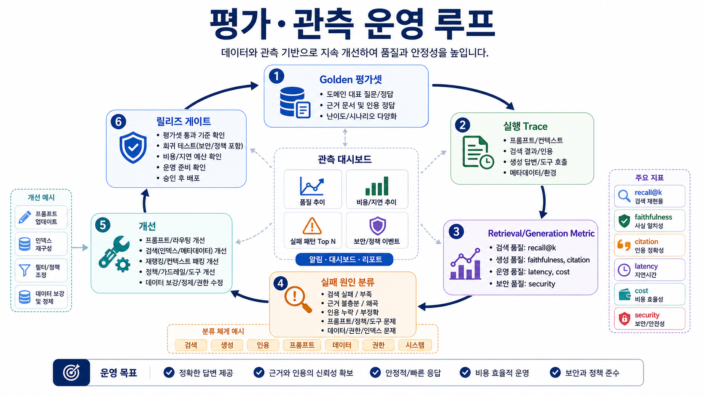
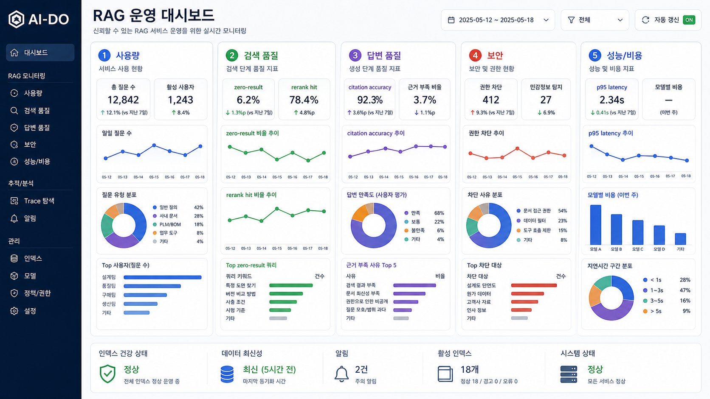
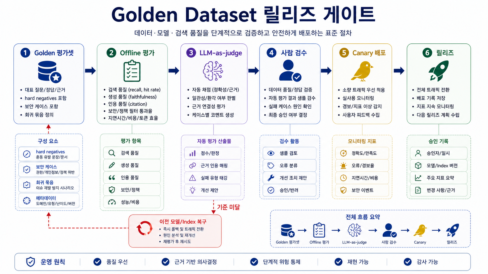
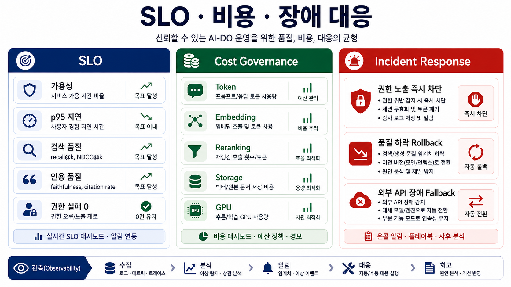

# 09. 평가·관측·운영 품질

> **한 줄 요약.** AI-DO 품질은 데모 한 번의 인상이 아니라, 평가셋·trace·검색 지표·생성 지표·운영 지표로 계속 비교할 수 있어야 한다.

## 오늘의 목표

RAG/LLM 시스템은 모델을 바꾸고, 문서가 추가되고, 권한이 바뀌고, 사용자가 늘면서 품질이 계속 변한다. 이번 회차는 AI-DO PoC를 운영 가능한 시스템으로 만들기 위한 평가와 관측 체계를 설계한다.

| 배울 것 | AI-DO 연결 |
| --- | --- |
| 평가셋 설계 | 부서별 대표 질문, 실패 질문, 권한 질문 |
| Retrieval 평가 | 정답 근거가 검색됐는지 확인 |
| Generation 평가 | 답변 정확도, 근거성, 인용 정확도 |
| Trace | 검색, rerank, 모델, 도구 호출 경로 추적 |
| 운영 지표 | 지연시간, 비용, 실패율, 사용자 피드백 |
| 릴리즈 게이트 | 모델/인덱스 변경 전후 품질 비교 |

## 평가 피라미드

_평가셋, trace, metric, 실패 분류, 개선, 릴리즈 게이트가 반복 루프로 연결돼야 운영 품질을 비교할 수 있다._

| 층 | 목적 | 예시 |
| --- | --- | --- |
| 단위 평가 | parser, chunker, 검색, reranker 개별 품질 | OCR 정확도, recall@10 |
| 시나리오 평가 | 실제 업무 질문에 end-to-end 답변 | “품번 X 변경 사유 요약” |
| 보안 평가 | 권한·데이터 등급·prompt injection | 권한 없는 문서 차단 |
| 운영 평가 | 비용, 속도, 장애, 사용량 | p95 latency, GPU 사용률 |
| 사용자 평가 | 현업 만족도와 수정 필요성 | thumbs up/down, 코멘트 |

## 평가셋 구성

| 유형 | 문항 수 예시 | 포함 이유 |
| --- | --- | --- |
| 사실 확인 | 10 | 특정 문서/PLM 항목을 정확히 찾는지 |
| 절차 안내 | 10 | 기준서와 업무 순서를 근거로 답하는지 |
| 유사 사례 | 10 | 표현이 다른 과거 사례를 찾는지 |
| 비교/요약 | 10 | 여러 문서의 차이를 근거 있게 정리하는지 |
| 표/수치 | 5 | 숫자, 품번, 날짜를 틀리지 않는지 |
| 권한/보안 | 5 | 접근 금지 문서가 노출되지 않는지 |
| no-answer | 5 | 근거 없을 때 억지로 답하지 않는지 |
| prompt injection | 5 | 문서 안 악성 지시를 무시하는지 |

평가셋에는 “잘 답할 질문”만 넣지 않는다. 실패할 만한 질문, 애매한 질문, 권한이 막혀야 하는 질문을 넣어야 운영 위험을 볼 수 있다.

## Retrieval 지표와 Generation 지표

| 영역 | 지표 | 의미 |
| --- | --- | --- |
| Retrieval | Recall@k | 정답 근거가 top-k 안에 있는가 |
| Retrieval | MRR/nDCG | 관련 문서가 위에 잘 올라오는가 |
| Retrieval | Filter accuracy | 권한/부서/날짜 필터가 맞는가 |
| Generation | Answer accuracy | 답변 결론이 맞는가 |
| Generation | Faithfulness | 답변이 근거 밖으로 나가지 않았는가 |
| Generation | Citation accuracy | 인용 문서가 실제 답변을 뒷받침하는가 |
| Generation | Abstention quality | 모를 때 모른다고 하는가 |
| Tool use | Tool selection accuracy | 적절한 도구를 골랐는가 |
| Tool use | Approval compliance | 승인 없이 write 하지 않는가 |

## Trace에 남겨야 할 것

| 구간 | 로그 항목 |
| --- | --- |
| 요청 | user_id, workspace, request_id, data grade |
| 라우팅 | 선택 모델, 내부/외부 경로, 차단/허용 사유 |
| 검색 | query rewrite, filters, index version, top-k |
| 재정렬 | reranker model, scores, selected chunks |
| 생성 | model, prompt template version, token count |
| 도구 호출 | capability, input hash, output hash, approval_id |
| 응답 | citations, confidence/warnings, latency, cost |
| 피드백 | 사용자 평가, 수정 코멘트, 신고 여부 |

민감 원문을 그대로 로그에 남기면 안 된다. 감사와 재현에 필요한 hash, ID, version, redacted text를 구분한다.

## 모델·인덱스 변경 릴리즈 게이트

| 변경 | 배포 전 확인 |
| --- | --- |
| LLM 모델 변경 | 평가셋 점수, 비용, 지연시간, 실패 유형 비교 |
| embedding 모델 변경 | 재색인 범위, recall@k, 저장 비용 비교 |
| chunking 전략 변경 | 정답 근거 위치, context 길이, 중복률 비교 |
| reranker 변경 | MRR/nDCG, p95 latency, 비용 비교 |
| prompt 변경 | faithfulness, citation accuracy, no-answer 품질 |
| 권한 정책 변경 | 접근 금지 케이스 회귀 테스트 |

## 운영 대시보드 초안

_운영 대시보드는 사용량, 검색 품질, 답변 품질, 보안, 성능/비용을 한 화면에서 볼 수 있어야 한다._

| 영역 | 지표 |
| --- | --- |
| 사용량 | 일별 질의 수, 부서별 사용량, 기능별 사용량 |
| 품질 | 정답률, faithfulness, citation accuracy, no-answer 비율 |
| 검색 | recall@k, rerank hit, zero-result rate |
| 보안 | 차단 건수, 권한 오류, 외부 API 라우팅 건수 |
| 성능 | 평균/p95 latency, timeout, retry |
| 비용 | 모델별 token, API 비용, GPU 사용률 |
| 운영 | 실패율, queue length, 장애 건수 |

## 실패 원인 분류

| 분류 | 증상 | 담당 개선 |
| --- | --- | --- |
| 데이터 없음 | 정답 문서 자체가 수집되지 않음 | 문서 수집/부서 협조 |
| 파싱/OCR 실패 | 문서가 있으나 텍스트가 깨짐 | ingestion pipeline |
| 검색 실패 | 정답 chunk가 후보에 없음 | query/retrieval |
| ranking 실패 | 후보에는 있으나 아래에 있음 | reranker/hybrid tuning |
| context 실패 | 정답 chunk가 모델 입력에서 빠짐 | context packing |
| 생성 실패 | 근거는 있는데 답변이 틀림 | prompt/model |
| 인용 실패 | 맞는 답이나 출처가 틀림 | citation logic |
| 권한 실패 | 보면 안 되는 문서 노출 | ACL/security |
| 도구 실패 | 잘못된 capability 호출 | tool policy/approval |

## Golden dataset 운영

_Golden dataset은 offline 평가, judge, 사람 검수, canary, rollback을 연결하는 릴리즈 게이트의 기준선이다._

평가셋은 한 번 만들고 끝나는 문서가 아니라 운영 자산이다. 모델, prompt, embedding, index가 바뀔 때마다 같은 질문으로 비교해야 한다.

| 원칙 | 설명 |
| --- | --- |
| Versioning | 평가셋 ID, 문항 버전, 정답 근거 버전을 관리 |
| Representative coverage | 부서, 문서 유형, PLM 데이터, 보안 케이스를 균형 있게 포함 |
| Hard negatives | 비슷하지만 정답이 아닌 문서, 권한상 차단되어야 하는 문서 포함 |
| Freshness | 최신 규정/변경 이력 반영, 폐기 문서 표시 |
| Human label | 고위험 문항은 담당자 검수로 정답 근거 확정 |
| Regression slice | 이전 장애나 사용자 신고 케이스를 별도 묶음으로 보존 |

PoC 초기에는 50문항으로 시작해도 된다. 중요한 것은 질문 수보다 문항마다 `정답 근거`, `허용 경로`, `실패 심각도`, `채점 기준`이 있는 것이다.

## LLM-as-judge와 사람 검수

LLM-as-judge는 빠른 품질 점검에 유용하지만 최종 정답자는 아니다.

| 채점 방식 | 장점 | 한계 | 권장 용도 |
| --- | --- | --- | --- |
| Rule/checker | 빠르고 재현 가능 | 의미 품질 판단 어려움 | JSON schema, citation 존재, 금칙어 |
| Retrieval metric | 검색 품질 분리 가능 | 답변 품질은 직접 보지 못함 | recall@k, nDCG, MRR |
| LLM-as-judge | 답변 정확성/충실성 평가 자동화 | judge 편향, 근거 오독, 모델 변경 영향 | 대량 후보 비교, 회귀 탐지 |
| Human review | 책임 있는 판단 | 비용과 시간 | 고위험 문항, 출시 전 샘플 |
| User feedback | 실제 현업 반응 | 노이즈와 선택 편향 | 운영 개선 backlog |

judge prompt와 judge model도 버전 관리해야 한다. 같은 답변이라도 judge 모델이 바뀌면 점수가 달라질 수 있기 때문이다.

## 실험과 릴리즈 운영

LLM/RAG 변경은 일반 코드 배포보다 비교 변수가 많다.

| 변경 대상 | 실험 방식 |
| --- | --- |
| Prompt | offline 평가셋 → shadow traffic → 일부 사용자 canary |
| LLM 모델 | 품질/비용/latency 동시 비교, 실패 유형 review |
| Embedding 모델 | blue/green index 생성 후 recall 비교 |
| Reranker | top-k 후보 동일 조건에서 순위 개선과 latency 비교 |
| Chunking | parser/chunker 버전별 정답 근거 포함률 비교 |
| Tool policy | red-team 케이스와 승인 로그 회귀 테스트 |

Canary 배포에서는 모델 응답만 비교하지 않는다. 검색 결과, 인용, 정책 판단, 비용, timeout, 사용자 수정률을 함께 본다.

## SLO와 incident response

_AI 기능의 SLO는 가용성·지연시간뿐 아니라 검색 품질, 인용 품질, 권한 실패, 비용까지 함께 다룬다._

AI 기능도 운영 서비스이므로 SLO와 장애 대응 기준이 필요하다.

| SLO 후보 | 예시 |
| --- | --- |
| Availability | 검색/답변 API 성공률 99% 이상 |
| Latency | interactive 질의 p95 5초 이하 |
| Retrieval quality | golden set recall@10 기준선 이하 하락 금지 |
| Citation quality | citation accuracy 기준선 이하 하락 금지 |
| Security | 권한 차단 실패 0건 |
| Cost | 질의당 평균 비용 또는 월 예산 상한 |

장애 대응은 실패 분류에 따라 달라진다. 권한 노출은 즉시 차단과 로그 보존이 우선이고, 품질 하락은 이전 모델/index로 rollback할 수 있어야 한다. 외부 API 장애는 내부 fallback 또는 기능 degradation 경로를 준비한다.

## Cost governance

AI 운영 비용은 model token 비용만이 아니다.

| 비용 항목 | 관리 방법 |
| --- | --- |
| Generation token | 모델별 token budget, max output, routing |
| Embedding | 증분 색인, batch, 재색인 범위 통제 |
| Reranking | 후보 수 제한, 고위험/복합 질문에만 적용 |
| Storage | 원본, parsed text, chunk, vector, trace 보존 기간 |
| GPU | utilization, queue, batching, quantization |
| Human review | 고위험 샘플링과 승인 UX 효율화 |
| Vendor/API | rate limit, fallback, 계약 조건, 월별 알림 |

대시보드는 비용을 “총액”으로만 보여 주면 늦다. 기능별, 부서별, 모델별, 성공/실패별 비용을 나눠야 개선 액션이 나온다.

## 관측 표준과 trace 구조

OpenTelemetry의 GenAI semantic convention처럼 공통 필드 이름을 참고하면, 나중에 도구를 바꾸더라도 trace를 비교하기 쉽다.

| Trace span | 포함할 속성 |
| --- | --- |
| `ai.request` | user_id, request_id, data_grade, feature |
| `retrieval.search` | query, filters, index_version, top_k, latency |
| `retrieval.rerank` | reranker, candidate_count, selected_count, scores |
| `llm.generate` | provider, model, prompt_version, input/output token, cost |
| `tool.call` | capability, risk_level, policy_result, approval_id |
| `ai.response` | citations, warnings, confidence, user_feedback |

원문을 그대로 trace에 넣지 않는 것이 기본이다. 재현에 필요한 ID와 hash를 남기고, 민감 텍스트는 redaction한다.

## 실습: W9 종합 평가셋 설계

1순위 부서 기준으로 50문항 평가셋을 만든다.

| 필드 | 작성 내용 |
| --- | --- |
| 질문 | 현업 사용자가 실제로 할 문장 |
| 의도 | 사실 확인/절차/유사 사례/비교/권한/no-answer |
| 정답 근거 | 문서 ID, PLM 항목, 페이지, 문단 |
| 기대 답변 | 짧은 정답 또는 채점 기준 |
| 허용 모델 경로 | 내부/외부/차단 |
| 실패 시 심각도 | 낮음/중간/높음 |
| 채점 방식 | rule/retrieval metric/LLM judge/human review |
| 회귀 묶음 | 일반/보안/이전 장애/사용자 신고 |

## 회상 질문

1. 공개 벤치마크 점수가 높아도 우리 업무 품질을 보장하지 않는 이유는 무엇인가?
2. 답변이 틀렸을 때 검색 문제와 생성 문제를 어떻게 구분하는가?
3. LLM-as-judge를 쓸 때 사람 검수 샘플이 필요한 이유는 무엇인가?
4. 모델 변경보다 embedding/chunking 변경이 더 큰 품질 변화를 만들 수 있는 이유는 무엇인가?
5. AI 기능의 SLO에는 왜 latency뿐 아니라 citation, 권한, 비용 지표가 함께 들어가야 하는가?

## 참고 원천

- Evaluation of Retrieval-Augmented Generation: A Survey: https://arxiv.org/abs/2405.07437
- Retrieval-Augmented Generation for Knowledge-Intensive NLP Tasks: https://papers.nips.cc/paper/2020/hash/6b493230205f780e1bc26945df7481e5-Abstract.html
- OpenTelemetry GenAI semantic conventions: https://opentelemetry.io/docs/specs/semconv/gen-ai/
- Ragas metrics: https://docs.ragas.io/en/stable/concepts/metrics/available_metrics/
- LangSmith evaluate RAG applications: https://docs.langchain.com/langsmith/evaluate-rag-tutorial
- OpenAI Models and tool-capable APIs: https://developers.openai.com/api/docs/models
