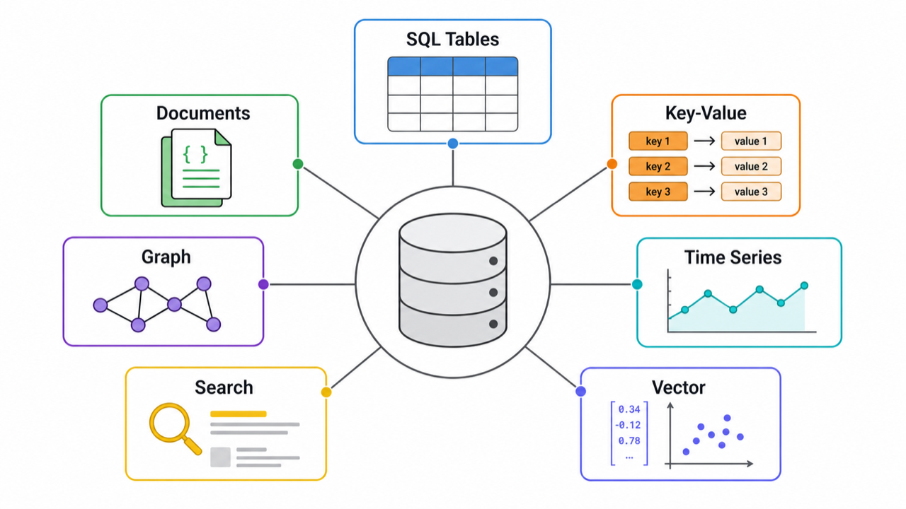
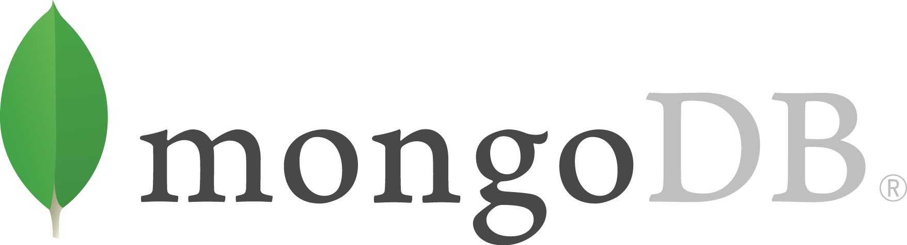
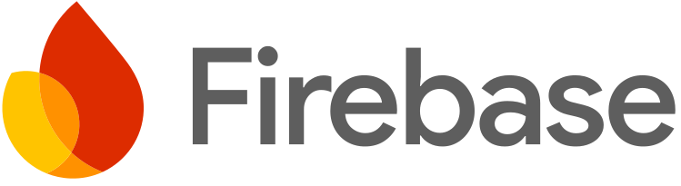

# 데이터베이스 입문 — 저장소를 고르는 법

> **한 줄 요약.** 데이터베이스 선택은 제품 이름 맞히기가 아니라 **데이터의 모양, 질문 방식, 지켜야 할 약속**을 맞추는 일이다.

이 과정은 YouTube 영상 [Every Database Explained in 5 Minutes](https://www.youtube.com/watch?v=7a80SSm-1y4)를 출발점으로 삼아, 처음 서비스를 만드는 사람이 데이터 저장소를 큰 그림으로 이해하도록 재구성했습니다. 영상에 나온 SQL, NoSQL, Key-Value, Column, Graph, Time-series, Distributed DB에 더해 검색 DB, 벡터 DB, 객체 저장소까지 함께 봅니다.

## 이 과정을 읽는 사람

- MySQL, PostgreSQL, MongoDB, Redis 같은 이름은 들어봤지만 차이가 흐릿한 사람.
- AI에게 "DB 설계해 줘"라고 요청하기 전에 최소한의 판단 기준을 갖고 싶은 사람.
- 서비스 초기에 어떤 저장소를 먼저 고르면 무난한지 알고 싶은 사람.

## 학습 목표

1. 관계형 DB, 문서 DB, 캐시, 검색 DB, 벡터 DB, 객체 저장소의 차이를 설명할 수 있다.
2. "빠르다", "유연하다", "확장된다" 같은 말 뒤의 대가를 질문할 수 있다.
3. 처음 서비스에서 무난한 기본 선택과 특수한 저장소가 필요한 순간을 구분할 수 있다.
4. AI에게 DB 선택을 맡길 때 데이터 모양, 쿼리, 정합성, 운영 조건을 함께 전달할 수 있다.

## 읽는 순서

| 순서 | 레슨 | 핵심 질문 |
| --- | --- | --- |
| 1 | 데이터베이스가 필요한 이유 | 왜 파일이나 메모리만으로는 부족한가 |
| 2 | 관계형 DB와 SQL | 표와 관계가 왜 기본 선택인가 |
| 3 | Document DB와 NoSQL | 유연한 문서 저장이 언제 도움이 되는가 |
| 4 | Key-Value와 캐시 | 빠른 임시 저장과 원본 DB는 어떻게 다른가 |
| 5 | Wide-column, columnar, 분석용 저장소 | 많은 데이터를 빠르게 읽는 구조는 무엇이 다른가 |
| 6 | Graph DB와 Time-series DB | 관계와 시간 흐름은 왜 별도 저장소가 있는가 |
| 7 | Distributed DB와 클라우드 DB | 여러 서버에 나눠 저장하면 무엇을 얻고 잃는가 |
| 8 | Search DB, Vector DB, Object Storage | 검색, AI 검색, 파일 저장은 왜 DB와 다르게 본다 |
| 9 | DB 선택 체크리스트 | 처음 서비스에서는 무엇부터 고르면 되는가 |

## 대표 로고 모음

아래 로고는 공식 브랜드 페이지, 공식 아이콘 패키지, Apache 저장소, SQLite 공식 사이트 등에서 가져온 자산입니다. 사용 조건은 `assets/ATTRIBUTION.md`에 따로 기록했습니다.

| 계열 | 대표 제품 |
| --- | --- |
| 관계형 DB |    |
| 문서/NoSQL |   |
| Key-Value/캐시 |   |
| Wide-column/분산 |   |
| 검색/벡터/파일 |     |

## 수업에서 계속 묻는 질문

- 이 데이터는 표처럼 일정한가, 문서처럼 들쭉날쭉한가?
- 가장 자주 하는 질문은 무엇인가? 조회, 검색, 추천, 집계, 파일 다운로드 중 무엇인가?
- 데이터가 틀리면 큰일 나는가, 잠깐 늦게 맞아도 되는가?
- 원본 저장소인가, 속도를 위한 복사본인가?
- 내가 직접 운영할 것인가, 클라우드 관리형 서비스를 쓸 것인가?
