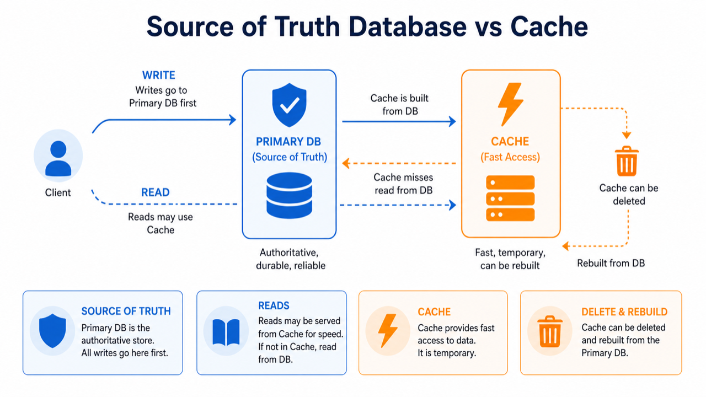

# 01. 데이터베이스가 필요한 이유

> **한 줄 요약.** 데이터베이스는 데이터를 오래 보관하는 장소이면서, 여러 사람이 동시에 써도 망가지지 않게 지키는 시스템이다.

초보자는 데이터베이스를 "데이터를 넣어 두는 폴더" 정도로 생각하기 쉽습니다. 하지만 서비스에서 필요한 것은 단순 저장보다 더 복잡합니다.

- 서버가 재시작되어도 데이터가 남아야 합니다.
- 여러 사용자가 동시에 읽고 써도 충돌을 통제해야 합니다.
- 필요한 데이터를 빠르게 찾을 수 있어야 합니다.
- 잘못 저장된 데이터를 되돌리거나 백업에서 복구할 수 있어야 합니다.



## 메모리, 파일, 데이터베이스의 차이

| 저장 방식 | 쉬운 비유 | 장점 | 한계 |
| --- | --- | --- | --- |
| 메모리 | 책상 위 메모 | 가장 빠름 | 프로그램이 꺼지면 사라짐 |
| 파일 | 컴퓨터 폴더 | 단순하고 직접적 | 동시 수정, 검색, 권한 관리가 약함 |
| 데이터베이스 | 관리자가 있는 자료실 | 동시성, 검색, 백업, 규칙 관리 | 운영과 설계가 필요함 |

서비스의 회원, 결제, 권한, 문서, 예약 정보는 보통 데이터베이스에 저장합니다. 반면 캐시는 빠르게 읽기 위한 복사본입니다. 캐시는 지워져도 다시 만들 수 있어야 합니다.

## 원본 저장소와 보조 저장소

처음 DB를 배울 때 가장 중요한 구분은 **원본(source of truth)** 입니다.

- 원본 DB: 데이터가 맞는지 판단할 최종 기준입니다. 예: 사용자, 주문, 권한.
- 캐시: 빠르게 읽기 위한 임시 복사본입니다. 예: 로그인 세션, 자주 보는 목록.
- 검색 인덱스: 검색을 빠르게 하기 위한 보조 구조입니다. 예: 문서 검색용 색인.
- 객체 저장소: 이미지, PDF, 동영상처럼 큰 파일을 저장합니다. DB에는 파일 주소만 둡니다.

## 초보자가 자주 하는 오해

| 오해 | 바로잡기 |
| --- | --- |
| DB는 하나만 고르면 된다 | 실제 서비스는 원본 DB, 캐시, 파일 저장소, 검색 인덱스를 함께 쓴다 |
| 빠른 DB가 가장 좋은 DB다 | 빠름보다 데이터 정합성, 운영 난이도, 질문 방식이 먼저다 |
| NoSQL이면 설계가 필요 없다 | 스키마가 DB 밖 코드와 운영 규칙으로 이동할 뿐이다 |
| 캐시에 저장했으니 안전하다 | 캐시는 지워질 수 있는 복사본이어야 한다 |

## AI에게 요청할 때

나쁜 요청:

```text
우리 서비스에 맞는 DB 추천해 줘.
```

좋은 요청:

```text
초기 서비스의 데이터 저장소를 추천해 줘.
데이터는 사용자, 워크스페이스, 권한, 문서, 파일 첨부, 검색으로 구성돼.
사용자/권한은 정확해야 하고, 파일은 이미지/PDF가 많아.
초기 운영자는 1명이라 운영 난이도가 낮아야 해.
원본 DB, 캐시, 파일 저장소, 검색 인덱스를 구분해서 제안해 줘.
```

## 확인 질문

1. 이 데이터가 사라지면 실제 사용자 피해가 있는가?
2. 동시에 여러 사람이 수정할 수 있는가?
3. 가장 자주 찾는 기준은 id, 날짜, 키워드, 위치, 관계 중 무엇인가?
4. 캐시나 검색 인덱스가 없어져도 원본 DB에서 다시 만들 수 있는가?

