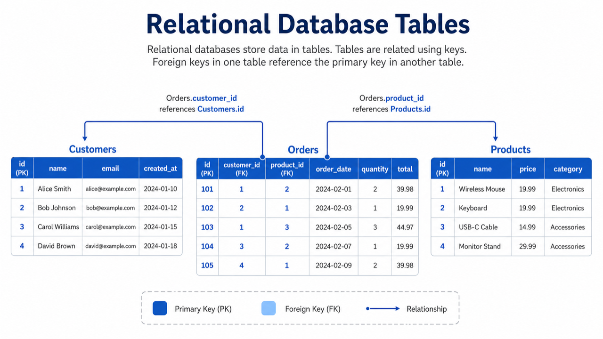
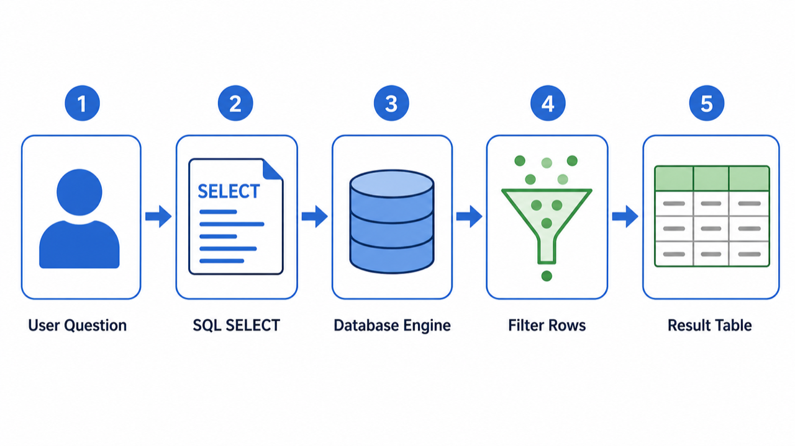

# 02. 관계형 DB와 SQL

> **한 줄 요약.** 관계형 DB는 데이터를 표로 나누고, 표 사이의 관계를 ID로 연결하는 가장 무난한 기본 선택이다.

관계형 DB는 영상에서 "엑셀처럼 행과 열이 있는 표"로 설명됩니다. 초보자에게는 이 비유가 좋습니다. 다만 실제 DB는 엑셀보다 훨씬 엄격합니다. 각 표에는 규칙이 있고, 여러 표가 서로 연결됩니다.



## 관계형 DB가 잘하는 일

| 잘하는 일 | 예시 |
| --- | --- |
| 구조가 명확한 데이터 | 사용자, 주문, 결제, 예약, 권한 |
| 데이터 간 관계 | 고객 1명이 주문 여러 개를 가진다 |
| 정확성이 중요한 처리 | 결제, 재고, 승인, 권한 변경 |
| 조건 조회와 집계 | 이번 달 주문 합계, 특정 팀의 멤버 목록 |

대표 제품은 PostgreSQL, MySQL, SQLite, SQL Server, Oracle입니다. 새 서비스를 처음 시작한다면 PostgreSQL이 가장 무난한 선택인 경우가 많습니다. SQLite는 앱 내부나 작은 도구처럼 단일 파일 DB가 필요할 때 좋습니다.

| PostgreSQL | SQLite | Google Cloud SQL |
| --- | --- | --- |
|  |  |  |

## SQL은 DB와 대화하는 언어

SQL은 "데이터베이스에게 질문하는 문장"입니다.



```sql
SELECT id, email
FROM users
WHERE workspace_id = 10;
```

위 문장은 "10번 워크스페이스에 속한 사용자의 id와 email을 보여 줘"라는 뜻입니다. 실제 앱 코드에서는 ORM을 통해 SQL을 직접 보지 않는 경우도 많지만, DB가 내부에서 하는 일은 결국 이런 질문과 응답입니다.

## 기본 개념

| 개념 | 쉬운 설명 |
| --- | --- |
| Table | 같은 모양의 데이터를 담는 표 |
| Row | 표의 한 줄, 데이터 한 건 |
| Column | 표의 항목, 예: email, created_at |
| Primary Key | 한 줄을 유일하게 찾는 ID |
| Foreign Key | 다른 표의 ID를 참조하는 연결 |
| Transaction | 여러 변경을 전부 성공 또는 전부 실패로 묶는 단위 |
| Index | 자주 찾는 컬럼을 빠르게 찾기 위한 책갈피 |

## 관계형 DB를 먼저 고려해야 하는 경우

- 사용자의 권한, 결제, 주문, 예약처럼 틀리면 안 되는 데이터가 많다.
- 데이터 모양이 어느 정도 안정적이다.
- 여러 표를 조합해서 보는 화면이 많다.
- 팀이 SQL과 운영 도구를 활용해야 한다.

## 초보자가 자주 하는 오해

| 오해 | 바로잡기 |
| --- | --- |
| 표 구조라서 유연하지 않다 | JSON 컬럼, nullable 컬럼, 별도 테이블로 충분히 유연하게 설계할 수 있다 |
| NoSQL보다 오래돼서 낡았다 | 오래 검증된 기본기라서 비즈니스 데이터에는 여전히 강하다 |
| 인덱스를 많이 만들수록 좋다 | 읽기는 빨라지지만 쓰기와 저장 공간 비용이 늘어난다 |

## AI에게 요청할 때

```text
이 기능의 관계형 DB 테이블 초안을 만들어 줘.
데이터: 사용자, 워크스페이스, 멤버십, 권한.
중요한 점: 한 사용자는 여러 워크스페이스에 속할 수 있고, 워크스페이스마다 역할이 다를 수 있어.
각 테이블의 primary key, foreign key, unique constraint, 필요한 인덱스를 함께 설명해 줘.
```

