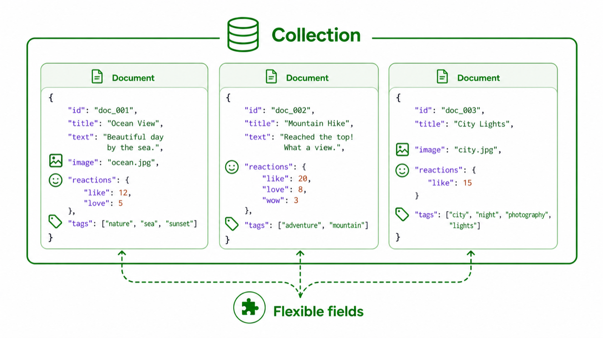

# 03. Document DB와 NoSQL

> **한 줄 요약.** Document DB는 데이터 한 건의 모양이 자주 바뀌거나 중첩 구조가 많은 경우에 편하다.

NoSQL은 "SQL을 안 쓴다"보다 "관계형 표 말고 다른 모양으로 저장한다"에 가깝습니다. 그중 초보자가 가장 자주 만나는 것이 Document DB입니다.



## Document DB의 저장 방식

관계형 DB가 표를 중심으로 생각한다면, Document DB는 JSON 같은 문서 한 덩어리를 중심으로 생각합니다.

```json
{
  "id": "msg_1",
  "text": "안녕하세요",
  "images": ["a.png"],
  "reactions": { "like": 3 },
  "tags": ["notice", "team"]
}
```

다음 메시지는 이미지가 없고, 또 다른 메시지는 투표 필드를 가질 수 있습니다. 이런 유연성이 Document DB의 장점입니다.

| MongoDB | Firebase |
| --- | --- |
|  |  |

## 잘 맞는 상황

- 채팅 메시지, 이벤트 로그, 설문 응답처럼 항목이 자주 바뀐다.
- 한 화면에서 문서 한 덩어리를 통째로 읽고 쓰는 일이 많다.
- 중첩 구조가 많고, JOIN이 거의 필요 없다.
- 빠른 프로토타입이 중요하고 운영 복잡도를 감당할 수 있다.

## 조심해야 할 점

Document DB는 "스키마가 없다"가 아닙니다. 스키마가 DB 안에 강하게 고정되지 않을 뿐, 앱 코드와 운영 규칙에는 여전히 존재합니다.

예를 들어 어떤 문서는 `userId`, 어떤 문서는 `user_id`, 또 어떤 문서는 `uid`를 쓰기 시작하면 3개월 뒤 검색과 분석이 어려워집니다. 유연함을 선택했다면 더 의식적으로 규칙을 정해야 합니다.

## 관계형 DB와 비교

| 질문 | 관계형 DB | Document DB |
| --- | --- | --- |
| 데이터 모양 | 표와 관계 | 문서 한 덩어리 |
| 관계 표현 | foreign key, JOIN | 문서 안에 중첩하거나 ID를 직접 저장 |
| 스키마 | DB가 강하게 관리 | 앱 코드와 운영 규칙이 관리 |
| 적합한 데이터 | 권한, 주문, 결제 | 채팅, 설정, 이벤트, 유연한 콘텐츠 |

## 초보자가 자주 하는 오해

| 오해 | 바로잡기 |
| --- | --- |
| NoSQL이면 DB 설계를 안 해도 된다 | 설계가 사라지는 게 아니라 다른 곳으로 이동한다 |
| Document DB가 관계형 DB보다 무조건 빠르다 | 조회 방식이 맞으면 빠르고, 관계 조합이 많으면 어려워진다 |
| JSON이면 전부 Document DB가 맞다 | PostgreSQL도 JSON 컬럼을 지원한다 |

## AI에게 요청할 때

```text
이 데이터가 Document DB에 맞는지 판단해 줘.
데이터 한 건은 설문 응답이고, 질문 종류가 고객마다 다르며,
응답 조회는 보통 설문 1건 전체를 통째로 읽는 방식이야.
관계형 DB와 Document DB 각각의 장단점, 나중에 검색/통계를 만들 때의 위험을 비교해 줘.
```

