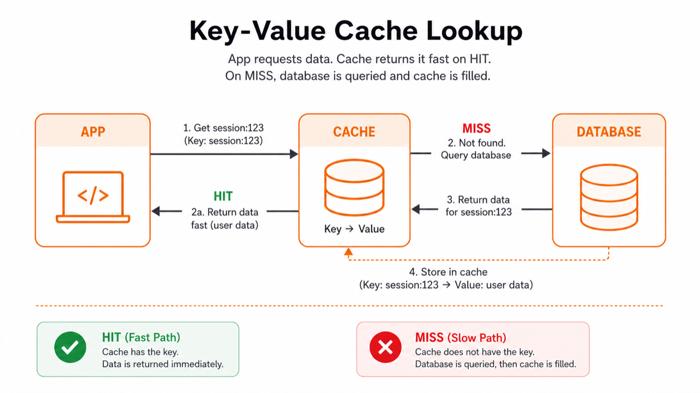

# 04. Key-Value와 캐시

> **한 줄 요약.** Key-Value 저장소는 이름표(key)로 값(value)을 빠르게 꺼내는 단순한 저장 방식이고, 캐시는 원본 DB를 대신하는 것이 아니라 보조하는 것이다.

Key-Value DB는 연락처 앱과 비슷합니다. 이름을 입력하면 전화번호가 나옵니다. 복잡한 검색이나 관계 조합은 잘하지 않지만, 단순 조회는 매우 빠릅니다.



## Key-Value의 기본 모양

| Key | Value |
| --- | --- |
| `session:abc` | 로그인 사용자 정보 |
| `rate-limit:user-1` | 1분 동안 요청한 횟수 |
| `job:123:status` | 백그라운드 작업 상태 |

대표 제품은 Redis, Valkey, DynamoDB, RocksDB입니다. Redis는 캐시, 세션, 큐에 자주 쓰이고, DynamoDB는 AWS의 관리형 key-value/document 계열 DB로 많이 쓰입니다.

| Redis | Amazon DynamoDB |
| --- | --- |
|  |  |

## 캐시가 필요한 이유

같은 데이터를 반복해서 읽으면 원본 DB에 부담이 갑니다. 캐시는 자주 읽는 결과를 잠깐 저장해 빠르게 돌려줍니다.

중요한 원칙은 하나입니다.

> 캐시는 지워져도 다시 만들 수 있어야 한다.

사용자 권한의 최종 진실은 원본 DB에 있어야 합니다. 캐시는 그 결과를 빠르게 읽기 위한 복사본입니다.

## 잘 맞는 상황

- 로그인 세션 저장.
- 자주 보는 설정값이나 목록 캐싱.
- 중복 요청 방지, rate limit.
- 백그라운드 작업 큐나 pub/sub.
- 짧은 시간만 필요한 임시 데이터.

## 잘못 쓰면 생기는 문제

| 문제 | 설명 |
| --- | --- |
| 원본과 캐시 불일치 | DB는 바뀌었는데 캐시가 오래된 값을 돌려줌 |
| 캐시 장애 | 캐시를 원본처럼 쓰면 장애 때 데이터가 사라질 수 있음 |
| 키 설계 혼란 | `user:1`, `users:1`, `u:1`처럼 규칙이 섞이면 운영이 어려움 |

## AI에게 요청할 때

```text
이 기능에 Redis 캐시를 붙여도 되는지 검토해 줘.
원본 DB는 PostgreSQL이고, 캐시하려는 데이터는 워크스페이스 멤버 권한 목록이야.
권한 변경 후 오래된 캐시가 남으면 보안 문제가 생길 수 있어.
캐시 키, TTL, 무효화 시점, 캐시가 꺼졌을 때의 fallback을 함께 제안해 줘.
```

