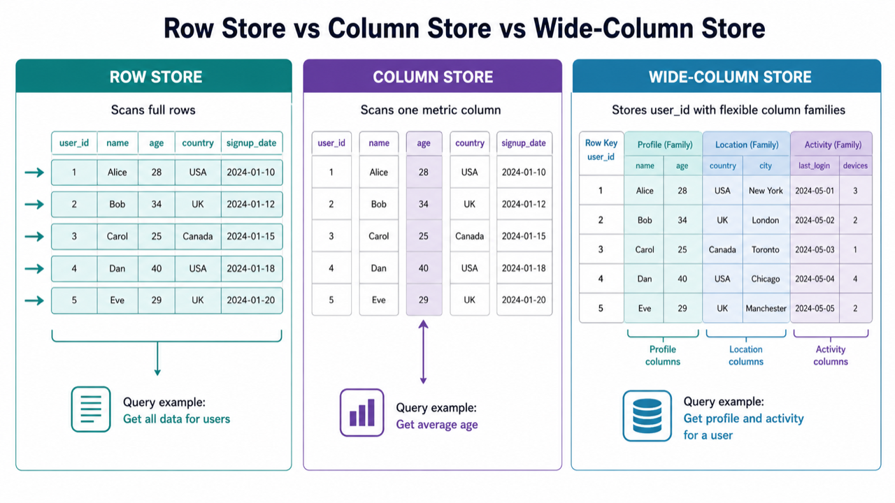

# 05. Wide-column, columnar, 분석용 저장소

> **한 줄 요약.** 많은 데이터를 빠르게 분석하려면, 데이터를 행 중심으로 볼지 열 중심으로 볼지부터 달라진다.

Column-based database는 많은 데이터에서 특정 열만 빠르게 읽는 구조입니다. 여기서 초보자가 헷갈리는 지점이 있습니다. Wide-column DB와 columnar analytics DB는 이름은 비슷하지만 목적이 다릅니다.



## 세 가지를 구분하기

| 이름 | 쉬운 설명 | 대표 용도 | 예시 |
| --- | --- | --- | --- |
| Row store | 한 사람의 모든 정보를 한 줄로 저장 | 일반 서비스 DB | PostgreSQL, MySQL |
| Columnar store | 같은 컬럼끼리 모아 분석에 최적화 | 대시보드, 리포트 | BigQuery, Redshift, ClickHouse |
| Wide-column | key별로 넓은 컬럼 묶음을 분산 저장 | 대규모 쓰기/읽기 | Cassandra, HBase, Bigtable |

관계형 DB는 한 주문의 여러 필드를 함께 읽기 좋습니다. 반대로 분석용 저장소는 수억 건에서 `sales_amount` 컬럼만 빠르게 훑는 데 강합니다.


## Columnar 분석 저장소가 잘 맞는 경우

- 매출, 클릭, 로그, 이벤트를 대량으로 모아 집계한다.
- "사용자 한 명의 상세 정보"보다 "전체 평균, 합계, 추세"가 중요하다.
- 데이터가 매우 많고, 읽는 컬럼이 일부에 집중된다.
- 운영 DB에 무거운 분석 쿼리를 직접 날리면 서비스가 느려진다.

## Wide-column DB가 잘 맞는 경우

- 쓰기량이 매우 많고 여러 서버에 나눠 저장해야 한다.
- 쿼리 패턴이 단순하고 미리 정해져 있다.
- 한 key 아래 관련 데이터를 넓게 펼쳐 저장하는 방식이 맞다.
- 강한 JOIN보다 수평 확장과 높은 처리량이 중요하다.

## 초보자가 자주 하는 오해

| 오해 | 바로잡기 |
| --- | --- |
| column이라는 말이 들어가면 다 같은 DB다 | columnar analytics와 wide-column은 설계 목적이 다르다 |
| 분석 DB가 있으면 운영 DB가 필요 없다 | 분석 DB는 보조 저장소인 경우가 많다 |
| 대기업이 쓰는 DB가 항상 좋은 선택이다 | 작은 서비스에는 운영 난이도만 커질 수 있다 |

## AI에게 요청할 때

```text
서비스 운영 DB와 분석 DB를 분리해야 하는지 판단해 줘.
운영 DB는 PostgreSQL이고, 이벤트 로그가 하루 500만 건 쌓일 수 있어.
관리자 화면에서는 날짜별 클릭 수, 기능별 사용량, 전환율을 봐야 해.
PostgreSQL만으로 시작할 수 있는 기준과, BigQuery/ClickHouse 같은 분석 저장소로 분리해야 하는 신호를 알려 줘.
```
