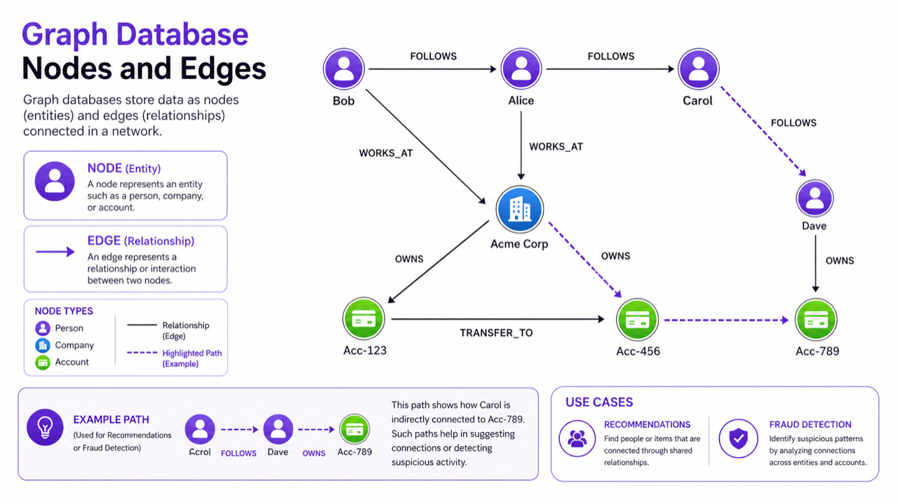
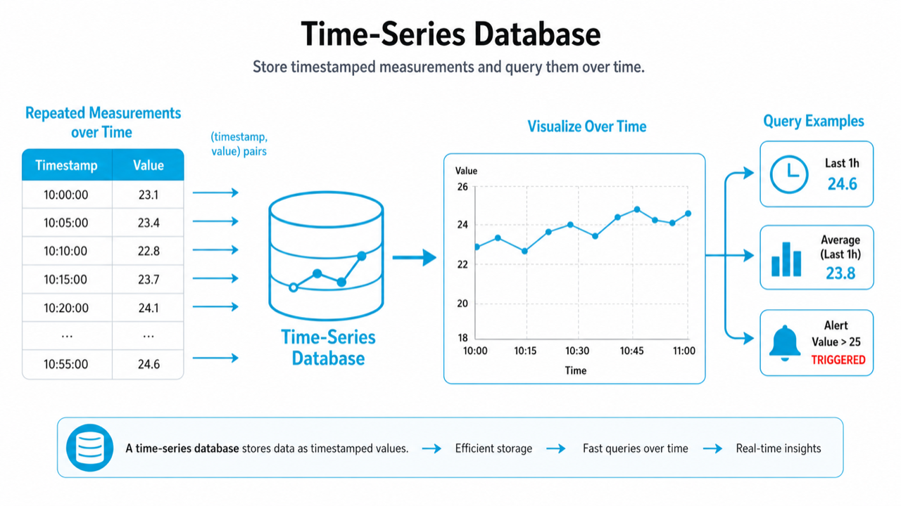

# 06. Graph DB와 Time-series DB

> **한 줄 요약.** 관계 자체가 주인공이면 Graph DB, 시간 흐름이 주인공이면 Time-series DB를 검토한다.

모든 데이터를 관계형 DB에 넣을 수는 있습니다. 하지만 어떤 문제는 특정 모양의 질문이 너무 많아서 전용 저장소가 유리합니다. Graph DB와 Time-series DB가 대표적입니다.

## Graph DB

Graph DB는 데이터를 node와 edge로 봅니다. 사람, 회사, 계좌 같은 대상은 node이고, 친구, 소속, 거래 같은 연결은 edge입니다.



잘 맞는 질문:

- A와 B 사이의 연결 경로는 무엇인가?
- 이 사용자의 친구의 친구 중 추천할 사람은 누구인가?
- 의심 거래가 여러 계좌를 거쳐 어떻게 이어지는가?
- 권한, 조직, 소유 관계가 여러 단계로 얽혀 있는가?

대표 제품은 Neo4j, Amazon Neptune, ArangoDB입니다. 이 과정에는 재배포 조건이 명확한 공식 로고만 넣는 원칙 때문에 Neo4j 로고는 포함하지 않았습니다.

## Time-series DB

Time-series DB는 시간이 붙은 값을 많이 저장하고 빠르게 집계하는 데 특화되어 있습니다.



예시:

- 서버 CPU, 메모리, 응답 시간.
- 주식 가격, 센서 온도, IoT 데이터.
- 사용자 이벤트 수, 에러 발생 횟수.
- 분 단위, 초 단위로 쌓이는 측정값.

대표 제품은 InfluxDB, TimescaleDB, Prometheus입니다.


## 둘의 차이

| 질문 | 더 어울리는 저장소 |
| --- | --- |
| "A와 B가 어떻게 연결돼 있나?" | Graph DB |
| "최근 1시간 평균 응답 시간은?" | Time-series DB |
| "친구의 친구 추천은?" | Graph DB |
| "CPU가 90% 넘은 시점은?" | Time-series DB |

## 처음 서비스에서는?

처음부터 Graph DB나 Time-series DB를 도입하기보다, PostgreSQL로 시작하고 문제가 커질 때 분리하는 편이 안전합니다. 예외는 서비스 핵심 기능이 처음부터 관계 탐색이나 시계열 분석인 경우입니다.

## AI에게 요청할 때

```text
이 요구사항에 Graph DB가 필요한지 검토해 줘.
사용자, 팀, 문서, 권한, 승인 라인이 여러 단계로 연결돼 있어.
주요 질문은 "이 사용자가 이 문서를 볼 수 있는 이유가 무엇인가"와
"승인 경로에서 다음 책임자는 누구인가"야.
PostgreSQL 재귀 쿼리로 충분한 경우와 Graph DB가 필요한 경우를 나눠 설명해 줘.
```

