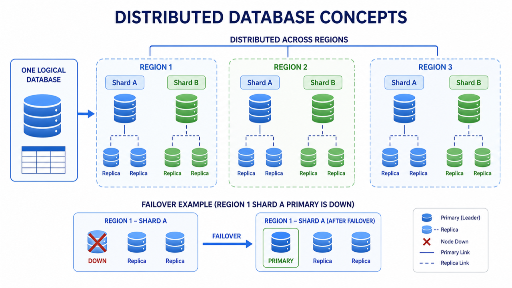
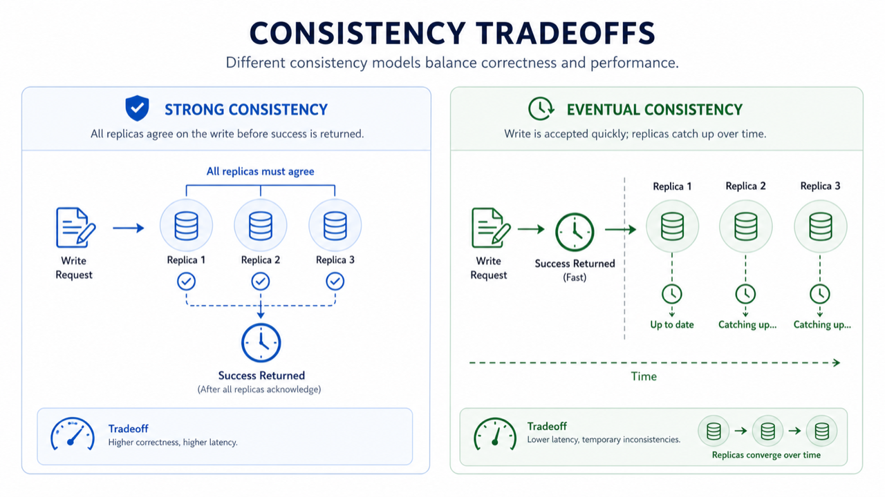

# 07. Distributed DB와 클라우드 DB

> **한 줄 요약.** 분산 DB는 여러 서버에 데이터를 나눠 담아 확장성과 장애 대응을 얻지만, 단순함과 일관성 관리 비용을 낸다.

Distributed database는 하나의 큰 컴퓨터 대신 여러 서버가 함께 하나의 DB처럼 동작하는 방식입니다. 대규모 서비스에서는 필수에 가깝지만, 처음 서비스에서는 과한 선택일 수 있습니다.



## 왜 나눠 저장하나

| 목적 | 설명 |
| --- | --- |
| 확장성 | 한 서버가 감당하기 어려운 읽기/쓰기를 여러 서버로 분산 |
| 가용성 | 한 서버가 죽어도 복제본이 대신 처리 |
| 지역 분산 | 사용자와 가까운 지역에서 더 빠르게 응답 |
| 대용량 | 데이터가 너무 커서 한 서버에 담기 어려움 |

## Shard와 Replica

- Shard: 데이터를 조각내서 나눠 담은 것. 예: 사용자 id 1~100만은 A 서버, 100만~200만은 B 서버.
- Replica: 같은 데이터를 복사한 것. 장애 대응과 읽기 확장에 사용합니다.

## 일관성 tradeoff

분산 DB에서 가장 중요한 질문은 "모든 복제본이 동시에 같은 값을 봐야 하는가?"입니다.



| 방식 | 장점 | 대가 |
| --- | --- | --- |
| Strong consistency | 읽을 때 항상 최신 값에 가깝다 | 느려질 수 있고 장애에 민감할 수 있음 |
| Eventual consistency | 빠르고 분산에 유리 | 잠깐 오래된 값을 볼 수 있음 |

결제, 권한, 재고처럼 틀리면 안 되는 데이터는 strong consistency가 중요합니다. 좋아요 수, 조회수, 추천 후보처럼 잠깐 늦어도 되는 데이터는 eventual consistency를 받아들일 수 있습니다.

| Amazon DynamoDB | Google Cloud Spanner |
| --- | --- |
|  |  |

## 클라우드 DB를 쓴다는 뜻

클라우드 DB는 "DB를 안 배워도 된다"가 아닙니다. 백업, 패치, 장애 조치, 확장 일부를 클라우드가 대신 해 주는 것입니다. 대신 비용, 벤더 종속성, 네트워크 설정을 이해해야 합니다.

## AI에게 요청할 때

```text
이 서비스가 분산 DB를 처음부터 써야 하는지 검토해 줘.
초기 사용자는 1만 명 이하이고, 중요한 데이터는 결제와 권한이야.
운영자는 1명이고 장애 대응 경험이 많지 않아.
PostgreSQL 관리형 서비스로 시작하는 선택과 DynamoDB/Spanner 같은 분산 DB 선택의 장단점을 비교해 줘.
```
