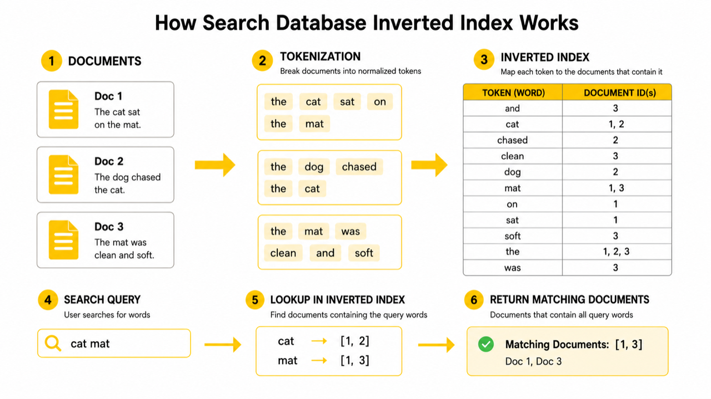
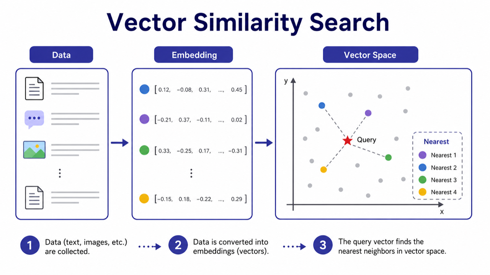
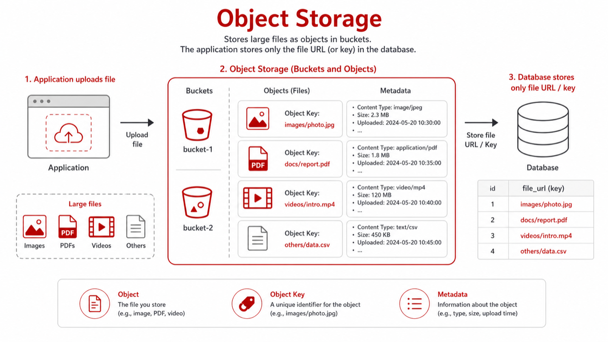

# 08. Search DB, Vector DB, Object Storage

> **한 줄 요약.** 키워드 검색, 의미 기반 AI 검색, 큰 파일 저장은 일반 DB의 보조 저장소로 분리해서 생각하는 편이 안전하다.

영상에는 직접 나오지 않지만, 현대 서비스에서 초보자가 자주 만나는 저장소가 세 가지 더 있습니다. Search DB, Vector DB, Object Storage입니다.

## Search DB

검색 DB는 문서를 토큰으로 쪼개고 inverted index를 만들어 키워드 검색을 빠르게 합니다.



일반 DB의 `LIKE '%검색어%'`로도 시작은 할 수 있지만, 검색어 하이라이트, 오타 허용, 형태소 분석, 랭킹이 필요해지면 검색 엔진이 유리합니다.

대표 제품은 Elasticsearch, OpenSearch, Meilisearch, Typesense입니다.


## Vector DB

Vector DB는 텍스트나 이미지를 숫자 배열인 embedding으로 바꾼 뒤, 의미가 가까운 항목을 찾습니다. AI 검색, 추천, RAG에서 자주 등장합니다.



예를 들어 "휴가 신청 규정"이라는 질문이 들어오면, 정확히 같은 단어가 없어도 "연차 사용 정책" 문서를 가까운 의미로 찾을 수 있습니다.

대표 제품은 Qdrant, Milvus, Weaviate, Pinecone입니다. PostgreSQL의 pgvector처럼 기존 관계형 DB에 벡터 검색을 붙이는 방법도 있습니다.


## Object Storage

이미지, PDF, 동영상, 첨부파일은 DB 테이블에 그대로 넣기보다 객체 저장소에 저장하는 경우가 많습니다. DB에는 파일의 key, URL, 크기, 타입 같은 메타데이터만 둡니다.



| MinIO | Amazon S3 |
| --- | --- |
|  |  |

## 세 저장소의 역할

| 저장소 | 잘하는 질문 | 원본인가 |
| --- | --- | --- |
| Search DB | 이 키워드가 들어간 문서는? | 보통 보조 인덱스 |
| Vector DB | 의미가 가까운 문서는? | 보통 보조 인덱스 |
| Object Storage | 이 파일을 업로드/다운로드하려면? | 파일 원본 저장소 |

## 초보자가 자주 하는 오해

| 오해 | 바로잡기 |
| --- | --- |
| 검색 DB에 저장했으니 원본 DB가 필요 없다 | 검색 인덱스는 원본에서 다시 만들 수 있어야 한다 |
| Vector DB가 있으면 일반 검색은 필요 없다 | 키워드 정확 검색과 의미 검색은 서로 보완한다 |
| 파일을 DB에 넣으면 관리가 쉽다 | 큰 파일은 백업, 성능, 전송 비용 때문에 객체 저장소가 보통 더 낫다 |

## AI에게 요청할 때

```text
문서 검색 기능의 저장소 구성을 제안해 줘.
원본 문서는 PostgreSQL에 metadata가 있고, 파일 본문은 객체 저장소에 있어.
사용자는 키워드 검색과 AI 의미 검색을 모두 원해.
OpenSearch, pgvector, Qdrant, MinIO/S3를 각각 어떤 역할로 둘지 설명하고,
원본 DB와 보조 인덱스의 동기화 실패 시 복구 방법도 포함해 줘.
```

