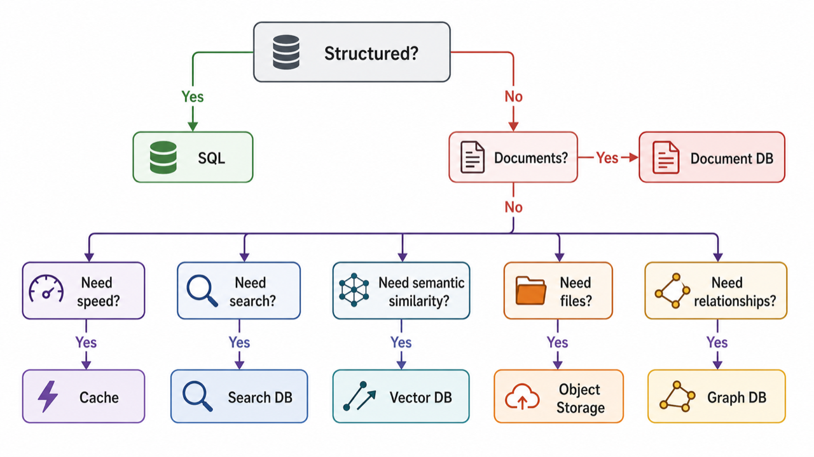
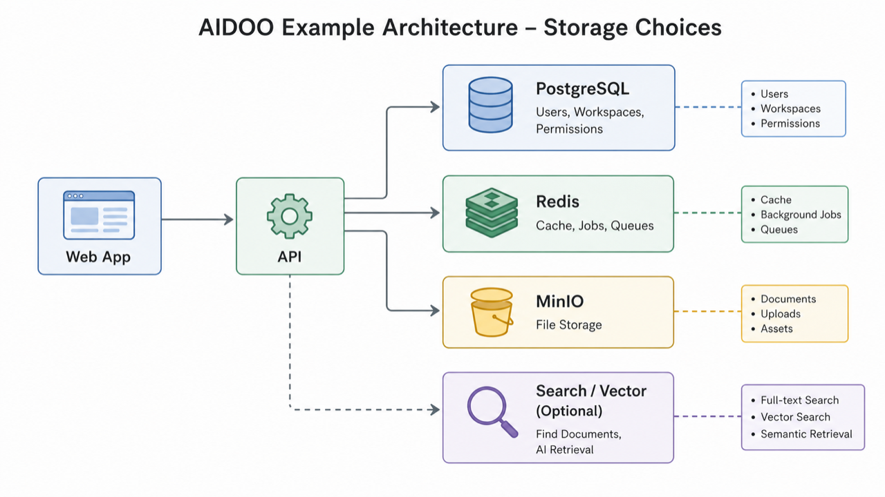

# 09. 처음 서비스에서 DB를 고르는 체크리스트

> **한 줄 요약.** 처음에는 PostgreSQL 같은 관계형 DB를 원본으로 두고, 캐시·검색·파일·벡터는 필요가 증명될 때 붙이는 전략이 가장 안전하다.

DB 선택은 제품명을 먼저 고르는 일이 아닙니다. 데이터와 질문을 먼저 봐야 합니다.



## 기본 추천

처음 서비스를 만든다면 다음 구성이 무난합니다.

| 역할 | 기본 선택 | 이유 |
| --- | --- | --- |
| 원본 DB | PostgreSQL | 관계, 트랜잭션, JSON, 운영 도구가 균형 좋음 |
| 캐시/큐 | Redis 또는 Valkey | 필요할 때 붙이고, 없어도 원본 DB로 fallback 가능 |
| 파일 | S3 호환 객체 저장소 또는 MinIO | 큰 파일을 DB와 분리 |
| 검색 | PostgreSQL full-text로 시작, 필요 시 OpenSearch | 검색 요구가 커질 때 분리 |
| AI 의미 검색 | pgvector로 시작, 필요 시 Qdrant 같은 Vector DB | 초기 운영 단순성 우선 |

## AI-DO식 저장소 예시



| 데이터 | 권장 위치 | 이유 |
| --- | --- | --- |
| 사용자, 워크스페이스, 권한 | PostgreSQL | 정확성과 관계가 중요 |
| 세션, 짧은 캐시, 작업 큐 | Redis | 빠른 임시 처리 |
| 첨부파일, 이미지, PDF | MinIO/S3 | 큰 파일 저장과 다운로드에 적합 |
| 문서 검색 인덱스 | OpenSearch 또는 PostgreSQL full-text | 원본에서 다시 만들 수 있는 보조 인덱스 |
| AI 검색용 embedding | pgvector 또는 Qdrant | 의미 기반 유사도 검색 |

## 최종 체크리스트

### 1. 데이터 모양

- 표처럼 일정하면 관계형 DB를 먼저 본다.
- 문서마다 필드가 크게 다르면 Document DB를 검토한다.
- 파일 자체가 크면 객체 저장소를 쓴다.

### 2. 질문 방식

- id, 날짜, 상태, 권한으로 찾으면 관계형 DB가 좋다.
- 키 하나로 빠르게 찾으면 Key-Value가 좋다.
- 키워드 검색이면 Search DB가 좋다.
- 의미가 비슷한 항목을 찾으면 Vector DB가 좋다.
- 연결 경로가 핵심이면 Graph DB가 좋다.
- 시간별 측정값이면 Time-series DB가 좋다.

### 3. 정확성

- 결제, 권한, 재고는 정확성이 먼저다.
- 좋아요 수, 조회수, 추천 후보는 잠깐 늦어도 되는지 검토할 수 있다.

### 4. 운영 난이도

- 작은 팀은 DB 종류를 늘릴수록 운영 부담이 커진다.
- 관리형 서비스를 쓰면 운영 부담은 줄지만 비용과 벤더 종속성이 생긴다.
- 보조 인덱스는 원본에서 재생성할 방법이 있어야 한다.

## AI에게 주는 최종 프롬프트

```text
우리 서비스의 저장소 구성을 검토해 줘.

데이터:
- 사용자, 조직, 권한, 결제: 정확해야 함
- 문서 본문과 첨부파일: 검색과 다운로드 필요
- AI 질문 답변: 문서 의미 검색 필요
- 알림/작업 상태: 빠른 임시 처리 필요

조건:
- 초기 팀은 2명이고 운영 경험이 많지 않음
- 처음 6개월은 사용자 1만 명 이하 예상
- 새 DB 종류를 늘리면 운영 부담도 함께 설명

출력:
- 원본 DB, 캐시, 파일 저장소, 검색 인덱스, 벡터 저장소를 분리해 제안
- 처음부터 도입할 것과 나중에 분리할 것을 나눠 설명
- 각 선택의 위험과 검증 방법 포함
```

## 이 과정을 끝낸 뒤 할 수 있어야 하는 말

"우리 서비스는 사용자와 권한이 중요하니까 원본은 관계형 DB로 두고, 파일은 객체 저장소, 검색과 벡터는 보조 인덱스로 둔다. 캐시는 원본이 아니라 속도 개선용이다. 처음부터 DB를 많이 늘리기보다, 질문 방식이 명확해지는 순간에 분리한다."

