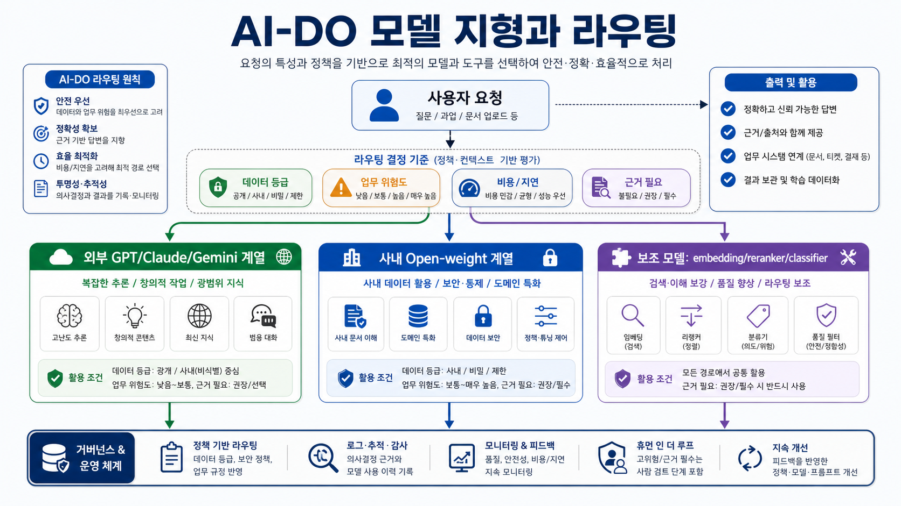
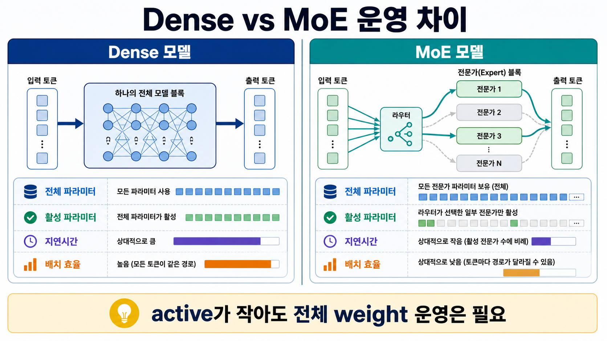
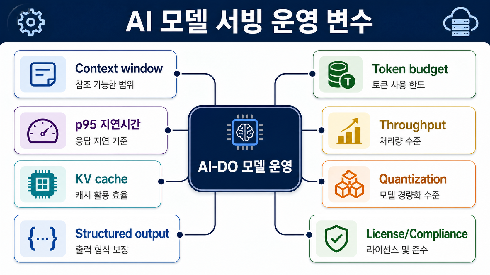
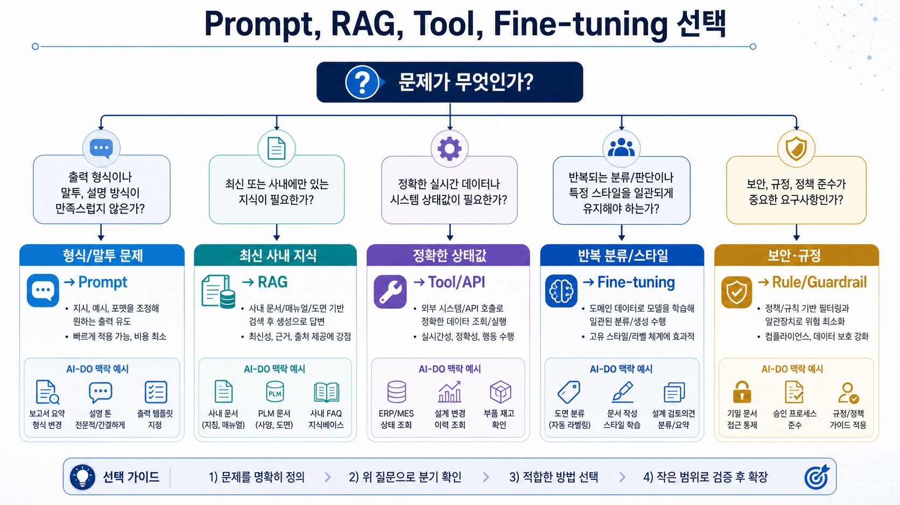

# 04. LLM 모델 지형과 모델 라우팅

> **한 줄 요약.** LLM 운영은 “제일 똑똑한 모델 하나”를 고르는 일이 아니라, 업무·데이터·비용·지연시간·보안 기준에 맞춰 여러 모델을 조합하는 일이다.

## 오늘의 목표

이번 회차는 Open Work Hub PoC에서 사용할 수 있는 모델 선택 감각을 만든다. 최신 모델 이름을 외우는 것이 목적이 아니다. 모델 계열, 아키텍처, 강점, 배치 방식, 위험도를 구분할 수 있어야 한다.

| 배울 것 | Open Work Hub에서 연결되는 판단 |
| --- | --- |
| Frontier API 모델 | 외부 API를 써도 되는 공개/대내 업무, 고난도 reasoning, 멀티모달 분석 |
| Open-weight 모델 | 사내 GPU, 사내망, 고객사/NDA 자료 처리, 비용 통제 |
| Dense 모델 | 작은 모델을 안정적으로 서빙하거나 특정 업무에 튜닝할 때 |
| MoE 모델 | 큰 총 파라미터 대비 낮은 active compute로 성능/비용 균형을 잡을 때 |
| Vision/multimodal 모델 | 스캔 PDF, 도면 이미지, 표, 차트, 화면 캡처를 이해할 때 |
| Embedding/reranker 모델 | RAG 검색 품질을 좌우하는 별도 모델 계층 |

## 왜 프로젝트 중심으로 봐야 하나

Open Work Hub는 단순 챗봇이 아니다. 문서중앙화 RAG, 업무 시스템 통합검색, 문서 초안 작성, 메일 초안, 회의록, 승인 게이트가 함께 움직인다. 그래서 모델 선택도 “답변 품질” 하나가 아니라 다음 조건을 같이 본다.

| 조건 | 확인 질문 |
| --- | --- |
| 데이터 등급 | 공개, 대내, 대외비, 고객사 NDA, 개인정보 중 어디에 속하는가? |
| 입력 형태 | 텍스트, 표, PDF, 이미지, 도면, 음성, 화면 중 무엇인가? |
| 업무 위험도 | 답변만 보여 주는가, 실제 시스템에 쓰기 작업을 하는가? |
| 품질 요구 | 요약이면 충분한가, 근거 인용과 수치 정확도가 필요한가? |
| 운영 비용 | 동시 사용자, 평균 토큰, GPU 메모리, API 비용을 감당할 수 있는가? |
| 감사 가능성 | 누가 어떤 모델로 어떤 근거를 사용했는지 남길 수 있는가? |

## 모델 지형을 읽는 법

_모델 계열을 데이터 등급, 업무 위험도, 비용/지연, 근거 필요성 기준으로 라우팅하는 흐름이다._

| 계열 | 대표 예 | 강점 | 주의점 |
| --- | --- | --- | --- |
| 고성능 reasoning API | frontier API 모델 | 복잡한 분석, 긴 문맥, 코딩/에이전트, 멀티모달 | 외부 전송 정책, 비용, 공급사 변경, 데이터 보존 조건 |
| 빠른 범용 API | Flash/mini/Haiku 계열 | 분류, 요약, 짧은 답변, 대량 처리 | 난도 높은 추론·정확한 근거 검증에는 약할 수 있음 |
| Open-weight 대형 모델 | Llama, Qwen, Mistral, DeepSeek 계열 | 사내망 배치, 비용 통제, 커스터마이징, 데이터 주권 | GPU 메모리, 서빙 최적화, 보안 패치, 모델 운영 역량 필요 |
| Small/dense 모델 | 3B~32B급 dense 모델 | 빠른 응답, 저비용, 분류·라우팅·후처리 | 복잡한 장문 reasoning에는 한계 |
| Multimodal/Vision 모델 | frontier vision API, open-weight VLM | 이미지·PDF·표·차트·도면 이해 | OCR 오류, 도면 해석 책임, 시각 자료 권한 |
| Embedding/reranker | text/image/multimodal embedding, cross-encoder, late-interaction | RAG 검색 품질 개선 | 생성 모델과 별도 평가·버전 관리 필요 |
| Media 모델 | image/video/audio/TTS/STT | 교육자료 이미지, 회의 녹취, 음성 인터페이스 | 저작권, 개인정보, 사내 자료 외부 전송 |

## Dense 모델과 MoE 모델

_Dense와 MoE는 성능 순위가 아니라 서빙 구조, 메모리, 지연시간, 배치 효율의 차이로 봐야 한다._

Dense와 MoE는 “성능 순위”가 아니라 운영 구조의 차이다.

| 구분 | Dense 모델 | MoE 모델 |
| --- | --- | --- |
| 기본 구조 | 모든 토큰이 모델의 대부분/전체 파라미터를 통과 | router가 토큰마다 일부 expert만 선택 |
| 장점 | 예측 가능한 지연시간, 단순한 서빙, 작은 모델 운영에 유리 | 총 용량은 크지만 active compute를 줄여 고성능/효율을 노림 |
| 운영 난점 | 큰 dense 모델은 매 토큰 비용이 큼 | 전체 expert weight 로딩, expert routing, 배치 효율, 메모리 배치가 까다로움 |
| 좋은 용도 | 사내 분류, 짧은 요약, 보안 라우팅, 특정 도메인 튜닝 | 고성능 오픈모델, 복잡한 reasoning, 사내망 대형 모델 후보 |
| Open Work Hub 판단 | 사내 GPU에 안정적으로 올릴 작은 업무 모델 | GPU/메모리/동시성 검증 뒤 핵심 답변 모델 후보 |

MoE 모델의 “active parameter”는 실제 계산에 참여하는 규모를 말한다. 하지만 전체 expert weight를 전혀 보유하지 않아도 된다는 뜻은 아니다. 서빙 엔진, 양자화, expert offload, batch 정책에 따라 메모리와 지연시간이 크게 달라진다.

## Reasoning, instruct, agentic 모델을 구분하기

| 유형 | 무엇을 잘하나 | Open Work Hub 예시 |
| --- | --- | --- |
| Instruct/chat | 사용자의 지시를 빠르게 따르고 자연스럽게 답변 | 짧은 질의응답, 문서 요약, 문장 다듬기 |
| Reasoning | 여러 조건을 놓고 단계적으로 판단 | 데이터 등급 라우팅, 복합 원인 분석, 평가 실패 진단 |
| Agentic/tool-use | 도구 호출 계획을 세우고 결과를 이어 붙임 | 업무 시스템 조회 → 문서 검색 → 보고서 초안 생성 |
| Code/coding agent | 코드 수정, 테스트, 리팩토링, PR 작성 | Open Work Hub 포털 기능 개발 보조 |
| Vision/multimodal | 이미지·문서·표·화면을 같이 이해 | 스캔 문서 OCR 검수, 도면 설명서 요약, 화면 오류 분석 |

모든 업무에 reasoning 모델을 쓰면 비용과 지연시간이 커진다. 반대로 모든 업무에 빠른 모델을 쓰면 복합 판단과 근거 검증에서 실패한다. 그래서 라우팅 정책이 필요하다.

## Open Work Hub 모델 라우팅 초안

| 업무 | 권장 경로 | 이유 |
| --- | --- | --- |
| 공개 교육자료 요약 | 외부 API 또는 저비용 fast model | 보안 위험 낮고 품질/속도 균형 중요 |
| 고객사 NDA 문서 질의 | 내부 LLM + RAG + 감사 로그 | 외부 전송 제한, 근거 추적 필요 |
| 업무 시스템 품번/BOM 조회 | 업무 시스템 API/SQL 우선 + LLM 설명 | 구조화 데이터는 모델 기억이 아니라 원천 시스템 조회가 기준 |
| 설계 변경 사유 유사 사례 | 하이브리드 RAG + reranker + 고품질 생성 모델 | 표현 차이가 크고 근거 인용 필요 |
| 스캔 PDF/도면 설명서 이해 | OCR/파서 + vision model + 사람 검수 | 시각 정보와 문서 구조가 품질에 영향 |
| 메일 초안 작성 | 데이터 등급별 내부/외부 분기 + 승인 | 쓰기 전 사람이 반드시 확인 |
| 평가셋 생성/실패 원인 분석 | reasoning model + trace | 단순 답변보다 진단 능력이 중요 |
| 대량 태깅/문서 분류 | small dense model 또는 batch API | 비용과 처리량이 중요 |

## 모델 선택 체크리스트

| 질문 | 선택 기준 |
| --- | --- |
| 민감 데이터가 포함되는가? | 포함되면 내부망, 비식별화, 사내 계약 API 중 하나로 제한 |
| 원문 근거가 필요한가? | 필요하면 RAG와 인용 UI가 필수 |
| 입력이 이미지/표/PDF인가? | vision, OCR, layout parser를 함께 검토 |
| 응답 지연 허용치는 얼마인가? | 실시간 UI는 fast model, 배치 분석은 고성능 reasoning 가능 |
| 동시에 몇 명이 쓰는가? | GPU 메모리, throughput, queue, fallback 필요 |
| 실패했을 때 영향이 큰가? | 쓰기 작업이면 미리보기와 승인 게이트 필수 |
| 모델을 바꿔도 품질을 비교할 수 있는가? | 평가셋과 trace가 없으면 운영 판단 불가 |

## AI 엔지니어가 반드시 보는 운영 변수

_모델 선택은 품질뿐 아니라 context, token, p95 지연, 처리량, KV cache, 양자화, 구조화 출력, 라이선스를 함께 본다._

모델 비교표는 benchmark 점수만으로 끝나면 안 된다. 실제 서비스에서는 모델 품질보다 아래 운영 변수가 먼저 병목이 된다.

| 변수 | 확인할 질문 | 운영 영향 |
| --- | --- | --- |
| Context window | 질문, 검색 근거, system policy, tool 결과를 모두 넣을 수 있는가? | 긴 문서를 무작정 넣으면 비용과 latency가 늘고 중요한 근거가 밀린다. |
| Token budget | 평균 입력/출력 token과 p95 token은 얼마인가? | 월 비용, timeout, queue 길이를 결정한다. |
| Latency | p50/p95/p99 응답 시간이 업무 UX에 맞는가? | 검색 UI, 챗봇, 배치 분석의 모델을 다르게 선택해야 한다. |
| Throughput | 동시 사용자와 batch 작업을 처리할 수 있는가? | GPU 서빙, API rate limit, retry/backoff 설계가 필요하다. |
| KV cache | 반복 대화나 긴 system context를 효율적으로 재사용할 수 있는가? | long context 모델의 실제 비용과 속도에 영향을 준다. |
| Quantization | 4bit/8bit 등 양자화 후 품질 손실이 허용되는가? | on-prem 모델을 올릴 수 있는지, 답변 품질이 유지되는지 결정한다. |
| Structured output | JSON schema, citation, tool argument를 안정적으로 지키는가? | 후속 시스템 연동과 승인 게이트 품질을 좌우한다. |
| Safety/compliance | 데이터 보존, 학습 사용 여부, 지역, 계약 조건이 맞는가? | 외부 API 사용 가능 범위와 감사 요구를 결정한다. |
| License | open-weight 모델의 상업적 사용, 재배포, 파생 모델 조건이 맞는가? | 사내 배포와 고객사 납품 가능성을 결정한다. |

Open Work Hub에서는 이 변수들을 모델 카드에 넣어야 한다. “답변이 좋아 보인다”는 데모 감상이고, “우리 평가셋에서 citation accuracy가 6%p 올랐지만 p95 latency가 2.1초 증가했다”는 운영 판단이다.

## Prompt, RAG, fine-tuning 선택 기준

_개선하려는 문제가 출력 형식인지, 최신 지식인지, 원천 시스템 상태값인지에 따라 선택지가 달라진다._

AI 엔지니어는 모델을 개선할 때 항상 fine-tuning부터 떠올리면 안 된다. 개선하려는 문제가 무엇인지에 따라 비용과 위험이 크게 달라진다.

| 방법 | 적합한 문제 | 부적합한 문제 | Open Work Hub 예시 |
| --- | --- | --- | --- |
| Prompt 개선 | 출력 형식, 말투, 판단 순서, no-answer 정책 | 최신 사내 지식이 부족한 문제 | 답변 카드 형식, 인용 문구, 경고 문구 통일 |
| RAG | 최신 문서, 부서별 지식, 업무 시스템 변경 이력 | 정확한 숫자/상태를 원천 DB에서 읽어야 하는 문제 | 기준서, 회의록, 변경 사유 검색 |
| Tool/API 호출 | 최신 상태, 권한이 있는 구조화 데이터, 실행이 필요한 작업 | 문서 의미 검색 | 품번/BOM/승인 상태 조회 |
| Fine-tuning/adapter | 특정 스타일, 반복 분류, 도메인 표현, 작은 모델 품질 개선 | 매일 바뀌는 지식 주입 | 문서 등급 분류, 현업 용어 normalization |
| Distillation | 고성능 모델의 판단을 작은 모델로 옮겨 비용 절감 | 근거가 필요한 최신 지식 답변 | 라우팅 분류기, 품질 judge 보조 모델 |
| Rule/guardrail | 법적·보안상 반드시 지켜야 하는 정책 | 자연어 의미 해석 전체 | 외부 API 차단, write 작업 승인 강제 |

실무 판단 순서는 보통 `원천 시스템/API 확인 → RAG로 근거 보강 → prompt/structured output 정리 → 작은 모델/분류기 최적화 → 필요 시 fine-tuning`이다.

## 서빙 아키텍처 판단

같은 모델이라도 어떻게 서빙하느냐에 따라 결과가 달라진다.

| 선택지 | 장점 | 주의할 점 |
| --- | --- | --- |
| 외부 API | 빠른 도입, 최신 frontier 모델, 운영 부담 낮음 | 데이터 전송 정책, 비용 예측, vendor lock-in |
| 사내 API gateway | 공급사별 정책·로그·fallback을 중앙화 | gateway 장애가 전체 AI 기능에 영향 |
| On-prem vLLM/Ollama/TGI | 사내망, 데이터 주권, GPU 통제 | 모델 패치, GPU 용량, queue, observability 필요 |
| Batch inference | 대량 문서 분류·요약 비용 절감 | 실시간 UX에는 부적합 |
| Cascade routing | 작은 모델이 먼저 처리하고 어려운 요청만 큰 모델로 escalate | 라우팅 실패가 품질 하락으로 이어질 수 있음 |

Open Work Hub PoC에서는 처음부터 모든 요청을 대형 모델로 보내지 않는다. 문서 분류, query rewrite, tool input extraction은 작은 모델로 처리하고, 복잡한 근거 기반 답변이나 실패 진단은 reasoning 모델로 넘기는 cascade가 현실적이다.

## 모델 운영 실패 사례

| 실패 | 왜 생기나 | 예방책 |
| --- | --- | --- |
| 비용 폭증 | 긴 문서 전체를 context에 넣거나 모든 요청을 대형 모델로 처리 | token budget, context packing, cascade routing |
| 품질 회귀 | 모델/prompt/index를 바꿨지만 평가셋이 없음 | 릴리즈 전 golden dataset 비교 |
| JSON 파싱 실패 | 모델이 tool input schema를 지키지 않음 | structured output, retry, schema validation |
| 권한 우회 | 외부 API 또는 RAG 검색에 민감 문서가 섞임 | data grade routing, ACL pre-filter, audit log |
| GPU OOM | MoE/open-weight 모델의 전체 weight와 KV cache를 과소평가 | load test, quantization 검증, max context 제한 |
| 라이선스 문제 | open-weight 모델의 사용 조건을 확인하지 않음 | 도입 전 license review와 배포 범위 확인 |

## 실습: Open Work Hub 모델 카드 작성

아래 표를 채워 후보 모델 3개를 비교한다. 모델명은 실제 도입 직전에 최신 공식 문서로 다시 확인한다.

| 항목 | 후보 A: 외부 frontier API | 후보 B: 내부 open-weight 대형 | 후보 C: small/dense 보조 모델 |
| --- | --- | --- | --- |
| 주요 용도 |  |  |  |
| 입력 형태 |  |  |  |
| 보안 허용 범위 |  |  |  |
| 장점 |  |  |  |
| 위험 |  |  |  |
| 평균/p95 latency |  |  |  |
| context/token budget |  |  |  |
| structured output 안정성 |  |  |  |
| 라이선스/계약 조건 |  |  |  |
| 평가 방법 |  |  |  |
| fallback |  |  |  |

## 회상 질문

1. Dense 모델과 MoE 모델의 차이는 운영 관점에서 무엇인가?
2. 업무 시스템 품번/BOM 검색을 LLM 기억에 맡기면 왜 위험한가?
3. vision 모델이 있어도 OCR/파서/사람 검수가 필요한 이유는 무엇인가?
4. 내부 LLM과 외부 API 라우팅 기준에 반드시 들어가야 할 항목은 무엇인가?

## 참고 원천

- OpenAI Models: https://developers.openai.com/api/docs/models
- Anthropic Claude Models: https://docs.claude.com/en/docs/about-claude/models/all-models
- Google Gemini API Models: https://ai.google.dev/gemini-api/docs/models
- 공급사 공식 모델 문서: OpenAI, Anthropic, Google Gemini 등.
- Open-weight model card와 release note: Llama, Qwen, Mistral, DeepSeek 등.
- Mistral model overview: https://docs.mistral.ai/models/overview
- Mistral 3 announcement: https://mistral.ai/news/mistral-3
