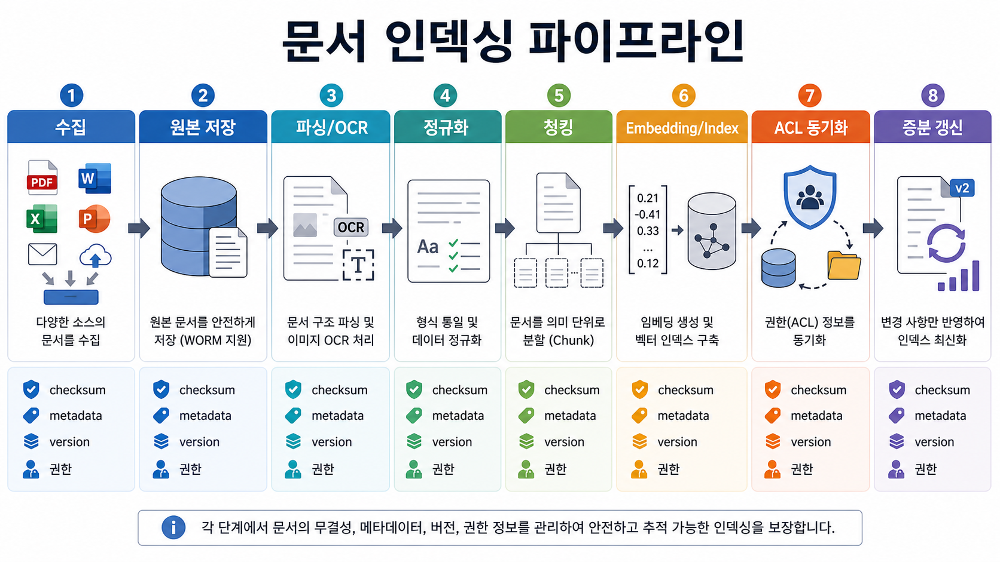
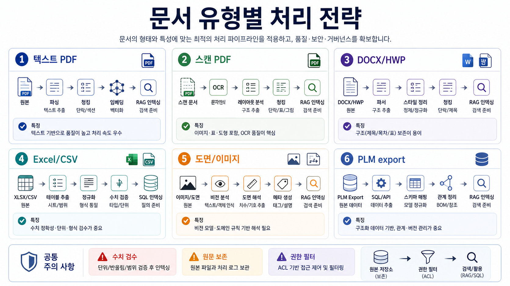
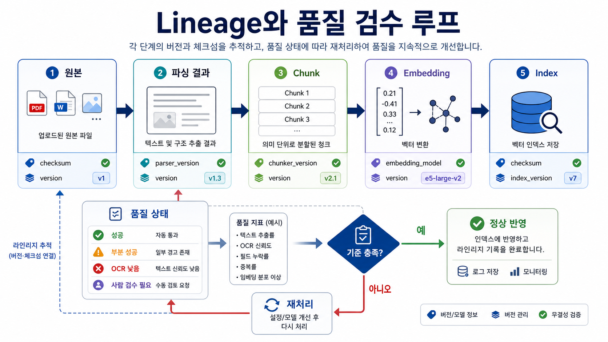
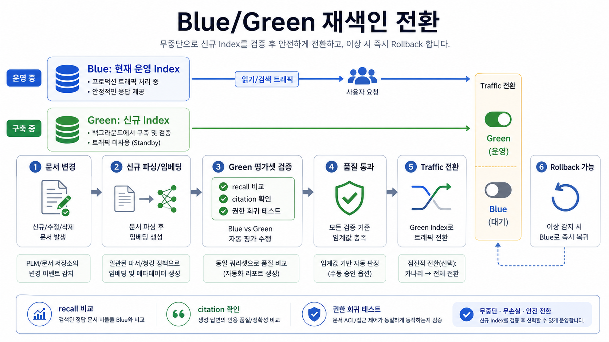

# 06. 문서 인덱싱 파이프라인

> **한 줄 요약.** RAG 품질은 모델보다 먼저 원본 보존, 파싱/OCR, 청킹, 메타데이터, 권한, 증분 색인의 품질에서 갈린다.

## 오늘의 목표

Open Work Hub 문서중앙화 RAG는 “파일 업로드 후 embedding”으로 끝나지 않는다. 원본 파일과 검색용 파생 데이터를 분리하고, 부서/제품/문서등급/권한/버전이 검색 결과에 끝까지 따라오게 만들어야 한다.

| 배울 것 | Open Work Hub 연결 |
| --- | --- |
| 원본과 파생 데이터 분리 | MinIO/객체 저장소, DB metadata, 검색 index 역할 구분 |
| OCR/파싱 전략 | PDF, 이미지, 문서, 표, 도면 설명서 처리 |
| 청킹 전략 | 문단, 표, 페이지, parent-child, semantic chunk |
| Metadata/ACL | 부서, 제품군, 문서등급, 권한을 검색 전부터 적용 |
| 증분 색인 | 문서 변경, 삭제, 권한 변경이 검색 결과에 반영 |

## 전체 파이프라인

_RAG 품질은 원본 저장부터 파싱, 청킹, 색인, ACL, 증분 갱신까지 이어지는 전체 파이프라인에서 결정된다._

| 단계 | 산출물 | 검수 기준 |
| --- | --- | --- |
| 1. 수집 | 원본 파일, 업무 시스템 export, 회의록, 메일 템플릿 | 출처·소유자·문서등급이 있는가 |
| 2. 원본 저장 | object key, checksum, version | 원본 복구와 감사가 가능한가 |
| 3. 파싱/OCR | 텍스트, 표, 이미지 설명, layout block | 누락·깨짐·오탈자가 허용 범위인가 |
| 4. 정규화 | 제목, 날짜, 부서, 품번, 문서번호 | 검색 필터로 쓸 수 있는가 |
| 5. 청킹 | chunk, parent document, page span | 의미가 끊기지 않고 너무 길지 않은가 |
| 6. Embedding/indexing | vector index, keyword index, metadata index | 검색 결과가 재현 가능한가 |
| 7. ACL 동기화 | 사용자/역할/부서별 접근 조건 | 권한 없는 결과가 검색 전부터 차단되는가 |
| 8. 증분 갱신 | reindex job, 삭제 tombstone, version map | 오래된 문서가 최신처럼 노출되지 않는가 |

## 문서 유형별 처리 전략

_PDF, 스캔 문서, 표, 도면, 업무 시스템 export는 같은 방식으로 색인하지 않고 parser, OCR, vision, SQL/API를 나눠 적용한다._

| 문서 유형 | 처리 방식 | 주의점 |
| --- | --- | --- |
| 텍스트 PDF | PDF parser + layout 유지 | 머리글/바닥글 반복 제거 |
| 스캔 PDF | OCR + page image 보존 | 수치·품번 오인식 검수 |
| DOCX/HWP 변환본 | 구조 파싱 + heading 추출 | 표와 문단 순서 보존 |
| Excel/CSV | 표 구조 유지 + row-level metadata | 자연어 chunk보다 table query가 적합할 수 있음 |
| 도면/이미지 | vision model 설명 + OCR + 원본 미리보기 | 모델 해석을 최종 사실로 취급하지 않음 |
| 업무 시스템 export | SQL/API 기준 원본 + 설명 필드만 RAG | 품번/BOM은 원천 시스템 우선 |
| 회의록/메일 | 날짜, 참석자, 프로젝트, 권한 metadata | 개인정보와 민감 표현 마스킹 |

## OCR, parser, vision model의 역할 구분

| 기술 | 잘하는 일 | 한계 |
| --- | --- | --- |
| Parser | 디지털 PDF/DOCX/표 구조 추출 | 스캔 이미지에는 약함 |
| OCR | 이미지 속 글자 추출 | 표 구조, 도면 의미, 품번 혼동 가능 |
| Vision model | 이미지·표·차트·화면의 의미 설명 | 수치 정확도와 근거 책임은 별도 검수 필요 |
| Human review | 고위험 문서 검수 | 비용과 시간 필요 |

도면, 검사표, 승인 문서처럼 실수 비용이 큰 자료는 vision model의 설명만으로 색인하지 않는다. 원본 이미지, OCR 텍스트, 모델 설명, 사람 검수 상태를 함께 저장한다.

## 청킹 전략

| 전략 | 장점 | 위험 | 적합한 문서 |
| --- | --- | --- | --- |
| 고정 길이 chunk | 구현이 쉽고 균일 | 표/문단 의미가 끊김 | 임시 PoC, 긴 일반 텍스트 |
| heading 기반 chunk | 사람이 읽는 구조와 맞음 | heading 품질에 의존 | 기준서, 매뉴얼 |
| semantic chunk | 의미 단위 보존 | 모델/알고리즘 의존 | 설명 문서, 회의록 |
| parent-child chunk | 작은 chunk 검색 후 큰 문맥 제공 | 구현 복잡 | 긴 정책 문서, 보고서 |
| table row chunk | 구조화 표 검색에 유리 | 문맥 상실 가능 | 품목표, 검사표 |
| multimodal chunk | 이미지+텍스트를 함께 검색 | 저장 비용과 평가 난이도 | 도면, 스캔 문서 |

## Metadata 설계

Open Work Hub의 metadata는 “있으면 좋은 설명”이 아니라 검색 품질과 보안의 핵심 입력이다.

| metadata | 쓰임 |
| --- | --- |
| `source_system` | 문서중앙화, 업무 시스템, 회의록, 메일 등 출처 구분 |
| `document_id`, `version` | 원문 추적과 증분 갱신 |
| `department`, `team` | 부서별 필터와 권한 |
| `product`, `part_no`, `project_code` | 업무 시스템/제품 검색 연결 |
| `document_type` | 기준서, 회의록, 도면, 변경요청서 등 |
| `security_level` | 공개/대내/대외비/NDA |
| `created_at`, `updated_at`, `valid_from` | 최신성 ranking |
| `acl_hash`, `allowed_roles` | 권한 동기화 검증 |
| `parser_version`, `embedding_model` | 색인 재현성과 회귀 분석 |

## 증분 색인과 삭제

| 이벤트 | 필요한 처리 |
| --- | --- |
| 원문 수정 | 새 version 생성, 기존 chunk 비활성화, 새 chunk 색인 |
| metadata 수정 | 검색 index metadata 업데이트 |
| 권한 변경 | ACL 재동기화, 캐시 무효화 |
| 문서 삭제 | 검색 결과 제거, 감사 목적 tombstone 보존 여부 결정 |
| parser/embedding 모델 변경 | 영향 범위 산정 후 재색인 batch |

## 데이터 계약과 lineage

_원본과 파생물의 버전, 처리 상태, 품질 검수 결과가 연결돼야 답변 오류를 추적하고 재처리할 수 있다._

인덱싱 파이프라인은 파일을 읽는 스크립트가 아니라 데이터 계약이다. 어떤 원본에서 어떤 파생물이 나왔는지 추적할 수 있어야 장애와 품질 회귀를 고칠 수 있다.

| 계약 항목 | 설명 |
| --- | --- |
| 원천 시스템 | 문서중앙화, 업무 시스템, 메일, 회의록, 수동 업로드 등 |
| 원본 식별자 | source document ID, version, checksum, object key |
| 파생물 식별자 | parsed text ID, chunk ID, embedding ID, index document ID |
| 변환 버전 | parser version, OCR model, vision caption model, chunker version, embedding model |
| 처리 시각 | 수집, 파싱, 색인, 권한 동기화 시각 |
| 품질 상태 | 성공, 부분 성공, OCR 낮음, 표 파싱 실패, 사람 검수 필요 |
| 삭제/폐기 정책 | 원문 삭제, tombstone 보존, 재처리 가능 기간 |

Lineage가 없으면 “답변이 왜 틀렸는가”를 추적할 수 없다. 정답 문서가 수집되지 않았는지, 파싱에서 깨졌는지, chunk가 잘렸는지, embedding 모델 변경 후 검색이 밀렸는지 구분해야 한다.

## 파싱 품질 검수 루프

Open Work Hub의 문서는 PDF, 스캔본, 표, 도면, 업무 시스템 export가 섞인다. 파싱 품질은 자동 지표와 사람 샘플링을 함께 써야 한다.

| 검수 항목 | 자동 확인 | 사람 확인 |
| --- | --- | --- |
| 텍스트 추출률 | 페이지별 문자 수, 공백/깨짐 비율 | 제목·본문·각주가 읽히는지 |
| 표 구조 | row/column 수, merged cell 처리 | 수치와 단위가 맞는지 |
| 품번/문서번호 | regex 추출, 원본 대비 누락률 | 유사 문자 오인식 여부 |
| 페이지/문단 위치 | page span, bounding box | 인용 위치가 원문과 맞는지 |
| 이미지 설명 | caption 존재, OCR confidence | 도면/차트 해석이 과장되지 않았는지 |

처음부터 완벽한 parser를 만들 필요는 없다. 대신 “품질 낮음” 상태를 metadata에 남기고, 고위험 답변에서는 해당 근거를 warning과 함께 보여 줘야 한다.

## 개인정보와 민감정보 처리

RAG 파이프라인은 원문을 잘 찾게 만드는 동시에, 보여 주면 안 되는 정보를 노출하지 않아야 한다.

| 정보 유형 | 처리 기준 |
| --- | --- |
| 개인정보 | 이름, 연락처, 이메일, 서명 이미지 등은 필요 최소한만 보존하고 masking 검토 |
| 고객사/NDA | 외부 API 라우팅 금지 또는 계약된 경로만 허용 |
| 영업/가격 정보 | 문서 등급과 역할 기반 접근 제어 강화 |
| 보안 정책 | 검색 결과와 답변 모두에서 노출 범위 확인 |
| 로그 데이터 | 원문 저장 대신 ID, hash, redacted text 중심으로 기록 |

중요한 원칙은 “검색 전에 권한을 적용하고, 답변 전에도 다시 확인한다”이다. vector index에서 이미 후보로 뽑힌 뒤 masking하는 방식만으로는 충분하지 않다.

## 재색인 운영 전략

_새 인덱스는 평가셋으로 검증한 뒤 전환하고, 문제가 생기면 이전 인덱스로 rollback할 수 있어야 한다._

재색인은 비용이 큰 작업이므로 트리거와 범위를 분리한다.

| 트리거 | 권장 처리 |
| --- | --- |
| 문서 본문 변경 | 해당 문서의 chunk와 embedding 재생성 |
| metadata만 변경 | 검색 index metadata 업데이트, 필요 시 rerank 재평가 |
| ACL 변경 | 권한 index/cache 갱신, 기존 검색 캐시 무효화 |
| parser 개선 | 영향 문서 샘플 평가 후 batch 재파싱 |
| embedding 모델 변경 | 전체 재색인 후보, A/B index 비교 후 전환 |
| chunking 전략 변경 | 평가셋으로 recall/context 품질 비교 후 migration |

운영에서는 blue/green index 전략이 유용하다. 새 index를 만들고 평가셋을 통과한 뒤 traffic을 전환하면, 잘못된 재색인으로 검색 전체가 망가지는 위험을 줄일 수 있다.

## 인덱싱 작업의 신뢰성

문서 인덱싱은 오래 걸리고 실패하기 쉽다. queue와 job 상태를 설계해야 한다.

| 설계 요소 | 이유 |
| --- | --- |
| Idempotency key | 같은 문서를 중복 처리해도 결과가 꼬이지 않게 함 |
| Retry/backoff | 일시적 OCR/API/스토리지 장애 복구 |
| Dead-letter queue | 반복 실패 문서를 운영자가 확인 |
| Partial success | 표만 실패하고 본문은 성공한 경우를 구분 |
| Progress tracking | 대량 재색인 작업의 진행률과 남은 시간을 표시 |
| Backpressure | 인덱싱이 검색/챗봇 운영 리소스를 잠식하지 않게 함 |
| Audit event | 누가 어떤 문서를 색인/삭제/재색인했는지 기록 |

## 실습: 샘플 문서 인덱싱 설계

샘플 문서 1개를 골라 아래 표를 채운다.

| 항목 | 설계 |
| --- | --- |
| 문서 유형 |  |
| 원본 저장 위치 |  |
| parser/OCR/vision 사용 여부 |  |
| chunk 기준 |  |
| 필수 metadata |  |
| 문서 등급 |  |
| 접근 가능 부서/역할 |  |
| 재색인 조건 |  |
| 검색 실패 시 확인할 로그 |  |
| lineage 필드 |  |
| 파싱 품질 검수 방법 |  |
| 민감정보 처리 |  |
| job 실패 처리 |  |

## 회상 질문

1. 원본 파일과 검색 index를 분리해야 하는 이유는 무엇인가?
2. 청킹 전략이 RAG 답변 품질에 영향을 주는 이유는 무엇인가?
3. 권한 변경이 발생했을 때 문서 본문을 다시 embedding해야 하는가, metadata/ACL만 갱신하면 되는가?
4. vision model이 만든 설명을 색인할 때 어떤 검수 상태를 함께 남겨야 하는가?
5. embedding 모델을 바꿀 때 왜 전체 재색인과 A/B index 비교가 필요한가?

## 참고 원천

- Google Gemini Embedding model overview: https://ai.google.dev/gemini-api/docs/models
- `learning/database-storage-basics/08-Search-Vector-Object-Storage.md`
- `learning/vibe-coding-foundations/31-MinIO-객체저장소.md`
