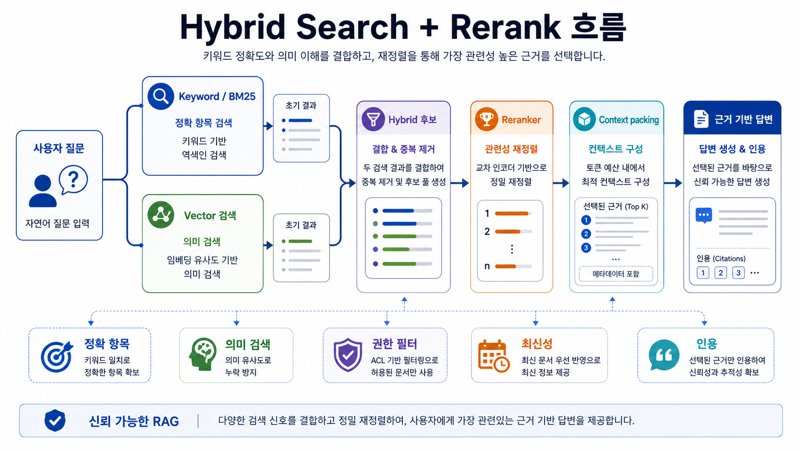
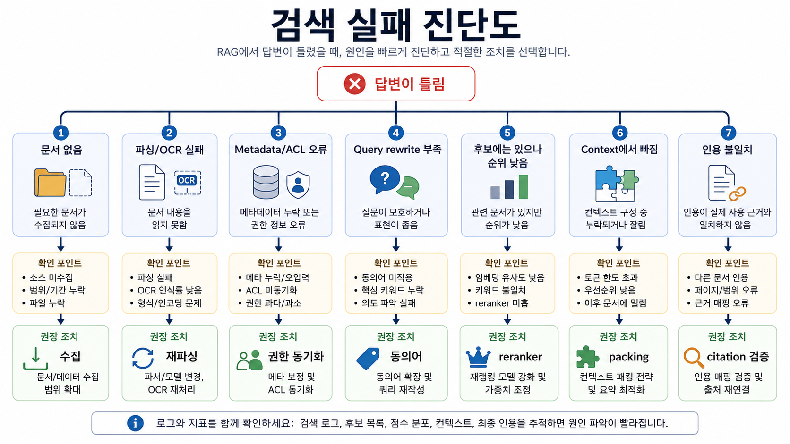
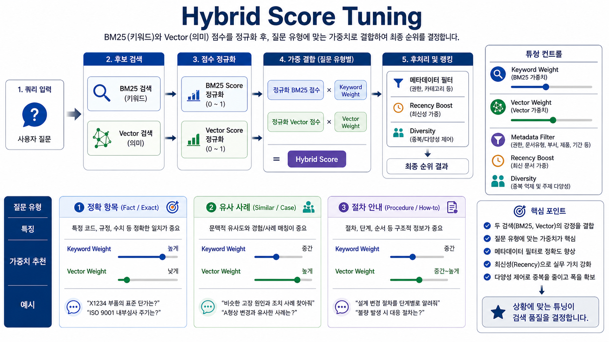
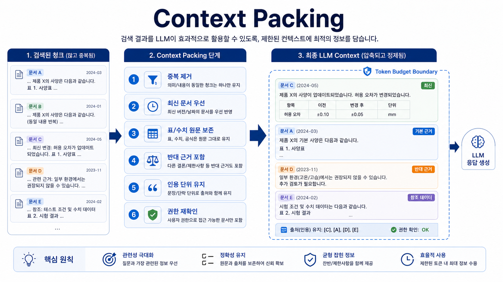

# 07. 검색 품질: 키워드·벡터·재정렬

> **한 줄 요약.** RAG 품질은 생성 모델보다 검색 recall, metadata filter, reranking, 근거 압축에서 먼저 무너진다.

## 오늘의 목표

Open Work Hub의 질문은 품번처럼 정확히 맞아야 하는 검색과, “유사한 불량 사례”처럼 의미가 가까운 자료를 찾는 검색이 섞인다. 이번 회차는 검색 방식을 경쟁시키는 것이 아니라 질문 유형별로 조합하는 방법을 익힌다.

| 배울 것 | Open Work Hub 연결 |
| --- | --- |
| Keyword/BM25 검색 | 품번, 문서번호, 고유명사, 정확한 표현 |
| Vector 검색 | 유사 표현, 증상, 요약, 개념 검색 |
| Sparse/dense/hybrid 검색 | 정확성과 의미 검색을 함께 확보 |
| Reranking | 후보 문서 중 답변에 쓸 근거를 다시 선별 |
| Multimodal retrieval | 이미지·표·스캔 PDF까지 검색 |
| 검색 평가 | recall@k, MRR, nDCG, faithfulness |

## 질문 유형별 검색 전략

| 질문 유형 | 예시 | 우선 검색 | 보완 |
| --- | --- | --- | --- |
| 정확 항목 | “P1234 BOM 최신 버전” | SQL/API, keyword | metadata filter |
| 문서 찾기 | “2025년 설계 변경 기준서” | keyword + metadata | vector |
| 유사 사례 | “물이 스며드는 문제와 비슷한 과거 사례” | vector | keyword synonym, reranker |
| 원인 분석 | “반복된 불량 원인은?” | hybrid | multi-hop RAG |
| 절차 안내 | “변경 요청 승인 절차” | vector + heading filter | recency |
| 표/수치 | “검사 기준값 비교” | table parser, SQL | LLM 요약 |
| 이미지/도면 | “이 도면에서 표시된 부품 설명” | vision/multimodal index | 원문 미리보기 |

## 검색 방식의 역할

| 방식 | 강점 | 약점 |
| --- | --- | --- |
| Keyword/BM25 | 정확한 단어, 품번, 약어, 문서번호 | 표현이 다르면 놓침 |
| Dense vector | 의미가 비슷한 문서 발견 | 고유명사/숫자/품번 정확도 약할 수 있음 |
| Sparse neural | 키워드와 의미 신호의 중간 | 모델/엔진 지원 필요 |
| Hybrid search | 정확성과 의미 검색 균형 | 점수 결합과 튜닝 필요 |
| Cross-encoder reranker | 질문-문서 쌍의 관련성 정밀 평가 | 느리고 비용 큼 |
| Late interaction | 토큰 수준 세밀한 매칭과 확장성 균형 | index와 serving 복잡 |
| LLM reranker | 복합 기준 판단 가능 | 비용, 지연시간, 일관성 관리 필요 |

## Reranking이 필요한 이유

_초기 검색은 후보를 넓게 잡고, reranker와 context packing은 실제 답변에 쓸 근거를 좁힌다._

초기 검색은 후보를 넓게 잡아야 한다. 답변 생성 단계는 그중 실제 근거가 될 문서만 가져가야 한다. 이 둘의 목적이 다르기 때문에 reranking이 필요하다.

| 단계 | 목표 | 실패하면 |
| --- | --- | --- |
| Retrieval | 놓치지 않기, recall 확보 | 정답 문서가 후보에도 없음 |
| Reranking | 관련성 높은 순서로 재배열 | 엉뚱한 근거가 context를 차지 |
| Context packing | 모델에 넣을 근거를 예산 안에 구성 | 중요한 문단이 잘림 |
| Citation selection | 답변에 사용한 근거만 표시 | 출처는 있는데 답변과 연결 안 됨 |

## Open Work Hub 검색 품질 설계

| 설계 요소 | 운영 기준 |
| --- | --- |
| 검색 전 권한 필터 | 사용자가 볼 수 없는 문서는 후보에도 넣지 않는다. |
| 최신성 가중치 | 규정/기준/승인 문서는 최신 버전을 우선한다. |
| 품번/문서번호 exact match | vector보다 exact 또는 SQL/API가 우선이다. |
| 동의어 사전 | 현업 표현, 영문/한글, 약어, 고객사 용어를 연결한다. |
| 근거 다양성 | 같은 문서의 비슷한 chunk만 반복해서 넣지 않는다. |
| no-answer 정책 | 근거가 부족하면 답하지 않거나 확인 요청을 한다. |
| 검색 trace | query rewrite, filter, top-k, rerank score를 남긴다. |

## 검색 품질 지표

| 지표 | 의미 | 쓰임 |
| --- | --- | --- |
| Recall@k | 정답 근거가 top-k 안에 있는가 | 검색 누락 확인 |
| Precision@k | top-k 중 관련 근거 비율 | 불필요한 문서 혼입 확인 |
| MRR | 첫 정답 근거가 얼마나 위에 있는가 | 사용자 검색 UX |
| nDCG | 관련도 높은 문서가 순서대로 있는가 | ranking 품질 |
| Faithfulness | 답변이 근거에 충실한가 | 생성 품질 |
| Citation accuracy | 인용한 근거가 실제 답변을 뒷받침하는가 | 신뢰성 |

## 검색 실패 진단

_답변 오류를 문서 수집, 파싱, metadata, ACL, query rewrite, ranking, context, citation 문제로 나눠 진단한다._

| 증상 | 먼저 볼 것 | 가능한 처방 |
| --- | --- | --- |
| 정답 문서가 아예 없음 | ingestion, ACL, metadata, index version | 재색인, 권한 동기화, 문서 수집 |
| 후보에는 있으나 순위가 낮음 | reranker, hybrid weight, query rewrite | reranker 교체, 동의어 보강 |
| 엉뚱한 부서 문서가 섞임 | metadata filter, ACL | 필터 기본값 강화 |
| 오래된 문서가 우선됨 | recency field, version policy | 최신성 boost, obsolete 표시 |
| 표 수치를 틀림 | table parser, chunk shape | row-level index, SQL 분기 |
| 이미지 문서를 못 찾음 | OCR/vision caption, multimodal embedding | vision pipeline 추가 |

## Embedding 모델 선택 기준

Embedding 모델은 생성 모델보다 덜 화려해 보이지만 RAG 품질을 크게 좌우한다. 모델이 바뀌면 기존 vector index와 검색 점수가 함께 바뀌므로 별도 버전 관리가 필요하다.

| 기준 | 확인할 내용 |
| --- | --- |
| 언어 | 한국어, 영어, 현업 약어, 품번 표현을 잘 처리하는가 |
| 입력 길이 | chunk 길이와 표/문단 구조를 감당하는가 |
| 도메인 적합성 | 사내 문서 표현과 기술 용어에서 recall이 나오는가 |
| Multimodal 지원 | 이미지, 표, 스캔 문서 caption까지 함께 검색해야 하는가 |
| 비용/속도 | 문서 수 증가와 재색인 비용을 감당할 수 있는가 |
| 배치 처리 | 대량 embedding 생성 시 rate limit과 throughput이 맞는가 |
| 버전 안정성 | 같은 입력에 대해 재현 가능한 index를 유지할 수 있는가 |

Embedding 선택은 공개 benchmark보다 자체 평가셋이 더 중요하다. Open Work Hub에서는 품번, 부서명, 고객사 용어, 한/영 혼용 질문을 반드시 평가셋에 넣는다.

## Hybrid score tuning

_질문 유형에 따라 keyword와 vector 비중, metadata filter, 최신성, 다양성 기준을 조정한다._

Hybrid search는 keyword 점수와 vector 점수를 더하는 것처럼 보이지만, 실제 운영에서는 정규화와 가중치가 핵심이다.

| 튜닝 항목 | 설명 |
| --- | --- |
| Score normalization | BM25와 vector 점수 범위가 다르므로 비교 가능한 형태로 변환 |
| Weighting | 정확 항목 질문은 keyword 비중, 유사 사례 질문은 vector 비중을 높임 |
| Metadata filter order | 권한/부서/기간 필터를 검색 전 적용할지 후 적용할지 결정 |
| Recency boost | 최신 기준서와 승인 문서를 우선 노출 |
| Diversity | 같은 문서의 유사 chunk가 top-k를 독점하지 않게 제한 |
| Query-type routing | 질문 분류 결과에 따라 검색 조합을 다르게 선택 |

튜닝은 운영자가 수동으로 느낌을 맞추는 작업이 아니다. 평가셋에서 recall@k, MRR, nDCG, zero-result rate를 비교하면서 조정한다.

## Context packing

_검색 후보를 그대로 넣지 않고 중복 제거, 최신성, 표/수치 보존, 인용 단위 유지, 권한 재확인을 거쳐 context를 구성한다._

검색 결과를 top-k 그대로 LLM에 넣으면 비용이 커지고 답변이 흔들린다. Context packing은 선택된 근거를 제한된 token 예산 안에 배치하는 과정이다.

| 규칙 | 이유 |
| --- | --- |
| 같은 문서 중복 chunk 제한 | 비슷한 문단이 context를 차지하는 것을 방지 |
| 최신/유효 문서 우선 | 폐기된 규정이 답변을 오염시키는 것을 방지 |
| 인용 가능한 단위 보존 | 답변 문장과 citation을 연결하기 위해 |
| 표/수치 원문 보존 | 요약 과정에서 숫자가 바뀌는 위험 감소 |
| 반대 근거 포함 | 규정 차이나 예외 조건을 놓치지 않기 위해 |
| 권한 재확인 | 검색 후보가 답변 context로 들어가기 전에 다시 검증 |

Context packing 실패는 generation 실패처럼 보인다. 하지만 실제로는 정답 근거가 모델 입력에서 빠졌거나, 너무 많은 무관 chunk가 들어가서 모델이 혼란스러워진 경우가 많다.

## Retrieval debug playbook

검색 품질을 고칠 때는 한 번에 모든 것을 바꾸지 않는다.

| 순서 | 확인 질문 |
| --- | --- |
| 1. 원문 존재 | 정답 문서가 수집 대상에 있는가? |
| 2. 파싱 품질 | 정답 문단이 텍스트/표/이미지 설명으로 추출됐는가? |
| 3. Metadata | 부서, 제품군, 날짜, 문서등급이 올바른가? |
| 4. ACL | 사용자가 볼 수 있는 문서인데 차단되거나, 볼 수 없는 문서가 노출되는가? |
| 5. Query rewrite | 현업 표현이 문서 표현으로 확장됐는가? |
| 6. Initial retrieval | 정답 chunk가 top-50 후보 안에 들어오는가? |
| 7. Reranking | 후보에 있던 정답 chunk가 top-k로 올라오는가? |
| 8. Packing/citation | 답변에 들어간 근거와 표시된 인용이 일치하는가? |

이 순서를 지키면 “모델이 답변을 못한다”는 막연한 문제를 ingestion, retrieval, ranking, generation 중 하나로 분해할 수 있다.

## 실습: 검색 전략 비교표

Open Work Hub 대표 질문 5개를 골라 검색 전략을 설계한다.

| 질문 | 정확 검색 조건 | 의미 검색 조건 | metadata filter | rerank 기준 | no-answer 기준 |
| --- | --- | --- | --- | --- | --- |
|  |  |  |  |  |  |
|  |  |  |  |  |  |
|  |  |  |  |  |  |

각 질문별로 baseline과 개선안을 나란히 기록한다.

| 항목 | Baseline | 개선안 |
| --- | --- | --- |
| 검색 방식 |  |  |
| top-k 후보에 정답 포함 여부 |  |  |
| rerank 후 순위 |  |  |
| context에 포함된 근거 |  |  |
| 답변 인용 정확도 |  |  |
| latency/cost 변화 |  |  |

## 회상 질문

1. 품번 검색에 vector 검색만 쓰면 어떤 문제가 생기는가?
2. Reranking은 검색 결과의 어떤 실패를 줄이는가?
3. 검색 품질과 답변 품질을 분리해서 평가해야 하는 이유는 무엇인가?
4. 멀티모달 검색이 필요한 문서 유형은 무엇인가?
5. Context packing 실패가 생성 모델 실패처럼 보이는 이유는 무엇인가?

## 참고 원천

- ColBERTv2: https://arxiv.org/abs/2112.01488
- Evaluation of Retrieval-Augmented Generation: A Survey: https://arxiv.org/abs/2405.07437
- `learning/database-storage-basics/08-Search-Vector-Object-Storage.md`
